<div ng-app="app">
  <!-- Modal -->
  <div class="modal fade" id="lightbulbs_banner_1" tabindex="-1" role="dialog" aria-labelledby="lightbulbs_banner_1_label">
    <div class="modal-dialog" role="document">
      <div class="modal-content">
        <div class="modal-header">
          <button type="button" class="close" data-dismiss="modal" aria-label="Close"><span aria-hidden="true">&times;</span></button>
          <h4 class="modal-title" id="lightbulbs_banner_1_label">Code Generator: Lightbulbs Banner Style 1</h4>
        </div>
        <div class="modal-body">
          <form>
            <div class="form-group">
              <label for="lightbulbs_banner_1_background_img">Background Image URL:</label>
              <input ng-model="background_img" type="text" class="form-control" id="lightbulbs_banner_1_background_img" ng-init="background_img='//cdn8.bigcommerce.com/s-3qvmac4a37/product_images/uploaded_images/lightbulbs-banner-section-1-bg.jpg'">
            </div>
            <div class="panel-group" id="lightbulbs_banner_1_accordion" role="tablist" aria-multiselectable="true">
              <div class="panel panel-default">
                <div class="panel-heading" role="tab" id="lightbulbs_banner_1_item1_heading">
                  <h4 class="panel-title">
                    <a role="button" data-toggle="collapse" data-parent="#lightbulbs_banner_1_accordion" href="#lightbulbs_banner_1_item1_collapse" aria-expanded="true" aria-controls="lightbulbs_banner_1_item1_collapse">
                      Row 1
                    </a>
                  </h4>
                </div>
                <div id="lightbulbs_banner_1_item1_collapse" class="panel-collapse collapse in" role="tabpanel" aria-labelledby="lightbulbs_banner_1_item1_heading">
                  <div class="panel-body">
                    <div class="form-group">
                      <label for="lightbulbs_banner_1_row1_heading">Heading:</label>
                      <input ng-model="row1_heading" type="text" class="form-control" id="lightbulbs_banner_1_row1_heading" ng-init="row1_heading='Ceiling <br>Lights'">
                    </div>
                    <div class="form-group">
                      <label for="lightbulbs_banner_1_row1_desc">Desc:</label>
                      <input ng-model="row1_desc" type="text" class="form-control" id="lightbulbs_banner_1_row1_desc"
                      ng-init="row1_desc='Add some shine with a ceiling lights!'">
                    </div>
                    <div class="form-group">
                      <label for="lightbulbs_banner_1_row1_link">Button URL:</label>
                      <input ng-model="row1_link" type="text" class="form-control" id="lightbulbs_banner_1_row1_link"
                      ng-init="row1_link='#'">
                    </div>
                    <div class="form-group">
                      <label for="lightbulbs_banner_1_row1_button_text">Button Text:</label>
                      <input ng-model="row1_button_text" type="text" class="form-control" id="lightbulbs_banner_1_row1_button_text"
                      ng-init="row1_button_text='Shop Now'">
                    </div>
                    <div class="form-group">
                      <label for="lightbulbs_banner_1_row1_image_1">Image :</label>
                      <input ng-model="row1_image_1" type="text" class="form-control" id="lightbulbs_banner_1_row1_image_1" ng-init="row1_image_1='//cdn8.bigcommerce.com/s-3qvmac4a37/product_images/uploaded_images/lightbulbs-banner-section-1-1.jpg'">
                    </div>
                    <div class="form-group">
                      <label for="lightbulbs_banner_1_row1_youtube_embed">Youtube Embed:</label>
                      <input ng-model="row1_youtube_embed" type="text" class="form-control" id="lightbulbs_banner_1_row1_youtube_embed" ng-init="row1_youtube_embed='<iframe width=&quot;560&quot; height=&quot;315&quot; src=&quot;https://www.youtube.com/embed/-vtBgNxMyZI&quot; frameborder=&quot;0&quot; allow=&quot;autoplay; encrypted-media&quot; allowfullscreen></iframe>'">
                    </div>
                  </div>
                </div>
              </div>
              <div class="panel panel-default">
                <div class="panel-heading" role="tab" id="lightbulbs_banner_1_item2_heading">
                  <h4 class="panel-title">
                    <a class="collapsed" role="button" data-toggle="collapse" data-parent="#lightbulbs_banner_1_accordion" href="#lightbulbs_banner_1_item2_collapse" aria-expanded="false" aria-controls="lightbulbs_banner_1_item2_collapse">
                      Row 2
                    </a>
                  </h4>
                </div>
                <div id="lightbulbs_banner_1_item2_collapse" class="panel-collapse collapse" role="tabpanel" aria-labelledby="lightbulbs_banner_1_item2_heading">
                  <div class="panel-body">
                    <div class="form-group">
                      <label for="lightbulbs_banner_1_row2_heading">Heading:</label>
                      <input ng-model="row2_heading" type="text" class="form-control" id="lightbulbs_banner_1_row2_heading" ng-init="row2_heading='Floor &amp; <br>Table Lamps'">
                    </div>
                    <div class="form-group">
                      <label for="lightbulbs_banner_1_row2_desc">Desc:</label>
                      <input ng-model="row2_desc" type="text" class="form-control" id="lightbulbs_banner_1_row2_desc"
                      ng-init="row2_desc='Add some shine with a floor lamp!<br> Our modern floor lamps'">
                    </div>
                    <div class="form-group">
                      <label for="lightbulbs_banner_1_row2_link">Button URL:</label>
                      <input ng-model="row2_link" type="text" class="form-control" id="lightbulbs_banner_1_row2_link"
                      ng-init="row2_link='#'">
                    </div>
                    <div class="form-group">
                      <label for="lightbulbs_banner_1_row2_button_text">Button Text:</label>
                      <input ng-model="row2_button_text" type="text" class="form-control" id="lightbulbs_banner_1_row2_button_text"
                      ng-init="row2_button_text='Shop Now'">
                    </div>
                    <div class="form-group">
                      <label for="lightbulbs_banner_1_row2_image_slider_1">Slider Image 1:</label>
                      <input ng-model="row2_image_slider_1" type="text" class="form-control" id="lightbulbs_banner_1_row2_image_slider_1" ng-init="row2_image_slider_1='//cdn8.bigcommerce.com/s-3qvmac4a37/product_images/uploaded_images/lightbulbs-banner-section-1-2.jpg'">
                    </div>
                    <div class="form-group">
                      <label for="lightbulbs_banner_1_row2_link_slider_1">Image 1 URL:</label>
                      <input ng-model="row2_link_slider_1" type="text" class="form-control" id="lightbulbs_banner_1_row2_link_slider_1"
                      ng-init="row2_link_slider_1='#'">
                    </div>
                    <div class="form-group">
                      <label for="lightbulbs_banner_1_row2_image_slider_2">Slider Image 2:</label>
                      <input ng-model="row2_image_slider_2" type="text" class="form-control" id="lightbulbs_banner_1_row2_image_slider_2" ng-init="row2_image_slider_2='//cdn8.bigcommerce.com/s-3qvmac4a37/product_images/uploaded_images/lightbulbs-banner-section-1-3.jpg'">
                    </div>
                    <div class="form-group">
                      <label for="lightbulbs_banner_1_row2_link_slider_2">Image 2 URL:</label>
                      <input ng-model="row2_link_slider_2" type="text" class="form-control" id="lightbulbs_banner_1_row2_link_slider_2"
                      ng-init="row2_link_slider_2='#'">
                    </div>
                    <div class="form-group">
                      <label for="lightbulbs_banner_1_row2_image_slider_3">Slider Image 3:</label>
                      <input ng-model="row2_image_slider_3" type="text" class="form-control" id="lightbulbs_banner_1_row2_image_slider_3" ng-init="row2_image_slider_3='//cdn8.bigcommerce.com/s-3qvmac4a37/product_images/uploaded_images/lightbulbs-banner-section-1-4.jpg'">
                    </div>
                    <div class="form-group">
                      <label for="lightbulbs_banner_1_row2_link_slider_3">Image 3 URL:</label>
                      <input ng-model="row2_link_slider_3" type="text" class="form-control" id="lightbulbs_banner_1_row2_link_slider_3"
                      ng-init="row2_link_slider_3='#'">
                    </div>
                    <div class="form-group">
                      <label for="lightbulbs_banner_1_row2_image_slider_4">Slider Image 4:</label>
                      <input ng-model="row2_image_slider_4" type="text" class="form-control" id="lightbulbs_banner_1_row2_image_slider_4" ng-init="row2_image_slider_4='//cdn8.bigcommerce.com/s-3qvmac4a37/product_images/uploaded_images/lightbulbs-banner-section-1-5.jpg'">
                    </div>
                    <div class="form-group">
                      <label for="lightbulbs_banner_1_row2_link_slider_4">Image 4 URL:</label>
                      <input ng-model="row2_link_slider_4" type="text" class="form-control" id="lightbulbs_banner_1_row2_link_slider_4"
                      ng-init="row2_link_slider_4='#'">
                    </div>
                  </div>
                </div>
              </div>
              <div class="panel panel-default">
                <div class="panel-heading" role="tab" id="lightbulbs_banner_1_item3_heading">
                  <h4 class="panel-title">
                    <a class="collapsed" role="button" data-toggle="collapse" data-parent="#lightbulbs_banner_1_accordion" href="#lightbulbs_banner_1_item3_collapse" aria-expanded="false" aria-controls="lightbulbs_banner_1_item3_collapse">
                      Row 3
                    </a>
                  </h4>
                </div>
                <div id="lightbulbs_banner_1_item3_collapse" class="panel-collapse collapse" role="tabpanel" aria-labelledby="lightbulbs_banner_1_item3_heading">
                  <div class="panel-body">
                    <div class="form-group">
                      <label for="lightbulbs_banner_1_row3_heading">Heading:</label>
                      <input ng-model="row3_heading" type="text" class="form-control" id="lightbulbs_banner_1_row3_heading" ng-init="row3_heading='Wall <br>Lights'">
                    </div>
                    <div class="form-group">
                      <label for="lightbulbs_banner_1_row3_desc">Desc:</label>
                      <input ng-model="row3_desc" type="text" class="form-control" id="lightbulbs_banner_1_row3_desc"
                      ng-init="row3_desc='Add some shine with a ceiling lights!'">
                    </div>
                    <div class="form-group">
                      <label for="lightbulbs_banner_1_row3_link">Button URL:</label>
                      <input ng-model="row3_link" type="text" class="form-control" id="lightbulbs_banner_1_row3_link"
                      ng-init="row3_link='#'">
                    </div>
                    <div class="form-group">
                      <label for="lightbulbs_banner_1_row3_button_text">Button Text:</label>
                      <input ng-model="row3_button_text" type="text" class="form-control" id="lightbulbs_banner_1_row3_button_text"
                      ng-init="row3_button_text='Shop Now'">
                    </div>
                    <div class="form-group">
                      <label for="lightbulbs_banner_1_row3_image_1">Image 1:</label>
                      <input ng-model="row3_image_1" type="text" class="form-control" id="lightbulbs_banner_1_row3_image_1" ng-init="row3_image_1='//cdn8.bigcommerce.com/s-3qvmac4a37/product_images/uploaded_images/lightbulbs-banner-section-1-6.jpg'">
                    </div>
                    <div class="form-group">
                      <label for="lightbulbs_banner_1_row3_image_2">Image 2:</label>
                      <input ng-model="row3_image_2" type="text" class="form-control" id="lightbulbs_banner_1_row3_image_2" ng-init="row3_image_2='//cdn8.bigcommerce.com/s-3qvmac4a37/product_images/uploaded_images/lightbulbs-banner-section-1-7.png'">
                    </div>
                  </div>
                </div>
              </div>
            </div>
            <div hljs include="'/samples/lightbulbs_home_banner1.txt'" compile="true" id="lightbulbs_home_banner1_code" class="highlight-code"></div>
          </form>
        </div>
        <div class="modal-footer">
          <button type="button" class="btn btn-default" data-dismiss="modal">Close</button>
          <button type="button" class="btn btn-primary" data-clipboard-target="#lightbulbs_home_banner1_code">Copy Code</button>
        </div>
      </div>
    </div>
  </div><!-- modal #lightbulbs_banner_1 -->
  <!-- Modal -->
  <div class="modal fade" id="lightbulbs_banner_2" tabindex="-1" role="dialog" aria-labelledby="lightbulbs_banner_2_label">
    <div class="modal-dialog" role="document">
      <div class="modal-content">
        <div class="modal-header">
          <button type="button" class="close" data-dismiss="modal" aria-label="Close"><span aria-hidden="true">&times;</span></button>
          <h4 class="modal-title" id="lightbulbs_banner_2_label">Code Generator: Lightbulbs Banner Style 2</h4>
        </div>
        <div class="modal-body">
          <form>
            <div class="form-group">
              <label for="lightbulbs_banner_2_background_img">Background Image URL:</label>
              <input ng-model="background_img" type="text" class="form-control" id="lightbulbs_banner_2_background_img" ng-init="background_img='//cdn8.bigcommerce.com/s-3qvmac4a37/product_images/uploaded_images/lightbulbs-banner-section-2-bg.jpg'">
            </div>
            <div class="panel-group" id="lightbulbs_banner_2_accordion" role="tablist" aria-multiselectable="true">
              <div class="panel panel-default">
                <div class="panel-heading" role="tab" id="lightbulbs_banner_2_item1_heading">
                  <h4 class="panel-title">
                    <a role="button" data-toggle="collapse" data-parent="#lightbulbs_banner_2_accordion" href="#lightbulbs_banner_2_item1_collapse" aria-expanded="true" aria-controls="lightbulbs_banner_2_item1_collapse">
                      Row 1
                    </a>
                  </h4>
                </div>
                <div id="lightbulbs_banner_2_item1_collapse" class="panel-collapse collapse in" role="tabpanel" aria-labelledby="lightbulbs_banner_2_item1_heading">
                  <div class="panel-body">
                    <div class="form-group">
                      <label for="lightbulbs_banner_2_row1_heading">Heading:</label>
                      <input ng-model="row1_heading" type="text" class="form-control" id="lightbulbs_banner_2_row1_heading" ng-init="row1_heading='LED Light Bulds'">
                    </div>
                    <div class="form-group">
                      <label for="lightbulbs_banner_2_row1_desc">Desc:</label>
                      <input ng-model="row1_desc" type="text" class="form-control" id="lightbulbs_banner_2_row1_desc"
                      ng-init="row1_desc='Add some shine with a LED light! <br>Our modern LED light'">
                    </div>
                    <div class="form-group">
                      <label for="lightbulbs_banner_2_row1_link">Button URL:</label>
                      <input ng-model="row1_link" type="text" class="form-control" id="lightbulbs_banner_2_row1_link"
                      ng-init="row1_link='#'">
                    </div>
                    <div class="form-group">
                      <label for="lightbulbs_banner_2_row1_button_text">Button Text:</label>
                      <input ng-model="row1_button_text" type="text" class="form-control" id="lightbulbs_banner_2_row1_button_text"
                      ng-init="row1_button_text='Shop Now'">
                    </div>
                    <div class="form-group">
                      <label for="lightbulbs_banner_2_row1_image_1">Image :</label>
                      <input ng-model="row1_image_1" type="text" class="form-control" id="lightbulbs_banner_2_row1_image_1" ng-init="row1_image_1='//cdn8.bigcommerce.com/s-3qvmac4a37/product_images/uploaded_images/lightbulbs-banner-section-2-1.gif'">
                    </div>
                  </div>
                </div>
              </div>
              <div class="panel panel-default">
                <div class="panel-heading" role="tab" id="lightbulbs_banner_2_item2_heading">
                  <h4 class="panel-title">
                    <a class="collapsed" role="button" data-toggle="collapse" data-parent="#lightbulbs_banner_2_accordion" href="#lightbulbs_banner_2_item2_collapse" aria-expanded="false" aria-controls="lightbulbs_banner_2_item2_collapse">
                      Row 2
                    </a>
                  </h4>
                </div>
                <div id="lightbulbs_banner_2_item2_collapse" class="panel-collapse collapse" role="tabpanel" aria-labelledby="lightbulbs_banner_2_item2_heading">
                  <div class="panel-body">
                    <div class="form-group">
                      <label for="lightbulbs_banner_2_row2_heading">Heading:</label>
                      <input ng-model="row2_heading" type="text" class="form-control" id="lightbulbs_banner_2_row2_heading" ng-init="row2_heading='Outdoor <br>&amp; Landscape'">
                    </div>
                    <div class="form-group">
                      <label for="lightbulbs_banner_2_row2_desc">Desc:</label>
                      <input ng-model="row2_desc" type="text" class="form-control" id="lightbulbs_banner_2_row2_desc"
                      ng-init="row2_desc='Add some shine with a ceiling lights!'">
                    </div>
                    <div class="form-group">
                      <label for="lightbulbs_banner_2_row2_link">Button URL:</label>
                      <input ng-model="row2_link" type="text" class="form-control" id="lightbulbs_banner_2_row2_link"
                      ng-init="row2_link='#'">
                    </div>
                    <div class="form-group">
                      <label for="lightbulbs_banner_2_row2_button_text">Button Text:</label>
                      <input ng-model="row2_button_text" type="text" class="form-control" id="lightbulbs_banner_2_row2_button_text"
                      ng-init="row2_button_text='Shop Now'">
                    </div>
                    <div class="form-group">
                      <label for="lightbulbs_banner_2_row2_image_1">Image:</label>
                      <input ng-model="row2_image_1" type="text" class="form-control" id="lightbulbs_banner_2_row2_image_1" ng-init="row2_image_1='//cdn8.bigcommerce.com/s-3qvmac4a37/product_images/uploaded_images/lightbulbs-banner-section-2-2.jpg'">
                    </div>
                  </div>
                </div>
              </div>
              <div class="panel panel-default">
                <div class="panel-heading" role="tab" id="lightbulbs_banner_2_item3_heading">
                  <h4 class="panel-title">
                    <a class="collapsed" role="button" data-toggle="collapse" data-parent="#lightbulbs_banner_2_accordion" href="#lightbulbs_banner_2_item3_collapse" aria-expanded="false" aria-controls="lightbulbs_banner_2_item3_collapse">
                      Row 3
                    </a>
                  </h4>
                </div>
                <div id="lightbulbs_banner_2_item3_collapse" class="panel-collapse collapse" role="tabpanel" aria-labelledby="lightbulbs_banner_2_item3_heading">
                  <div class="panel-body">
                    <div class="form-group">
                      <label for="lightbulbs_banner_2_row3_heading">Heading:</label>
                      <input ng-model="row3_heading" type="text" class="form-control" id="lightbulbs_banner_2_row3_heading" ng-init="row3_heading='Lighting Accessories'">
                    </div>
                    <div class="form-group">
                      <label for="lightbulbs_banner_2_row3_desc">Desc:</label>
                      <input ng-model="row3_desc" type="text" class="form-control" id="lightbulbs_banner_2_row3_desc"
                      ng-init="row3_desc='Explore brilliant selection of home lighting hardware and accessories  like light bulbs, lamp adapter kits.'">
                    </div>
                    <div class="form-group">
                      <label for="lightbulbs_banner_2_row3_link">Button URL:</label>
                      <input ng-model="row3_link" type="text" class="form-control" id="lightbulbs_banner_2_row3_link"
                      ng-init="row3_link='#'">
                    </div>
                    <div class="form-group">
                      <label for="lightbulbs_banner_2_row3_button_text">Button Text:</label>
                      <input ng-model="row3_button_text" type="text" class="form-control" id="lightbulbs_banner_2_row3_button_text"
                      ng-init="row3_button_text='Shop Now'">
                    </div>
                    <div class="form-group">
                      <label for="lightbulbs_banner_2_row3_image_slider_1">Slider Image 1:</label>
                      <input ng-model="row3_image_slider_1" type="text" class="form-control" id="lightbulbs_banner_2_row3_image_slider_1" ng-init="row3_image_slider_1='//cdn8.bigcommerce.com/s-3qvmac4a37/product_images/uploaded_images/lightbulbs-banner-section-2-3.jpg'">
                    </div>
                    <div class="form-group">
                      <label for="lightbulbs_banner_2_row3_link_slider_1">Image 1 URL:</label>
                      <input ng-model="row3_link_slider_1" type="text" class="form-control" id="lightbulbs_banner_2_row3_link_slider_1"
                      ng-init="row3_link_slider_1='#'">
                    </div>
                    <div class="form-group">
                      <label for="lightbulbs_banner_2_row3_image_slider_2">Slider Image 2:</label>
                      <input ng-model="row3_image_slider_2" type="text" class="form-control" id="lightbulbs_banner_2_row3_image_slider_2" ng-init="row3_image_slider_2='//cdn8.bigcommerce.com/s-3qvmac4a37/product_images/uploaded_images/lightbulbs-banner-section-2-4.jpg'">
                    </div>
                    <div class="form-group">
                      <label for="lightbulbs_banner_2_row3_link_slider_2">Image 2 URL:</label>
                      <input ng-model="row3_link_slider_2" type="text" class="form-control" id="lightbulbs_banner_2_row3_link_slider_2"
                      ng-init="row3_link_slider_2='#'">
                    </div>
                    <div class="form-group">
                      <label for="lightbulbs_banner_2_row3_image_slider_3">Slider Image 3:</label>
                      <input ng-model="row3_image_slider_3" type="text" class="form-control" id="lightbulbs_banner_2_row3_image_slider_3" ng-init="row3_image_slider_3='//cdn8.bigcommerce.com/s-3qvmac4a37/product_images/uploaded_images/lightbulbs-banner-section-2-5.jpg'">
                    </div>
                    <div class="form-group">
                      <label for="lightbulbs_banner_2_row3_link_slider_3">Image 3 URL:</label>
                      <input ng-model="row3_link_slider_3" type="text" class="form-control" id="lightbulbs_banner_2_row3_link_slider_3"
                      ng-init="row3_link_slider_3='#'">
                    </div>
                    <div class="form-group">
                      <label for="lightbulbs_banner_2_row3_image_slider_4">Slider Image 4:</label>
                      <input ng-model="row3_image_slider_4" type="text" class="form-control" id="lightbulbs_banner_2_row3_image_slider_4" ng-init="row3_image_slider_4='//cdn8.bigcommerce.com/s-3qvmac4a37/product_images/uploaded_images/lightbulbs-banner-section-2-6.jpg'">
                    </div>
                    <div class="form-group">
                      <label for="lightbulbs_banner_2_row3_link_slider_4">Image 4 URL:</label>
                      <input ng-model="row3_link_slider_4" type="text" class="form-control" id="lightbulbs_banner_2_row3_link_slider_4"
                      ng-init="row3_link_slider_4='#'">
                    </div>
                  </div>
                </div>
              </div>
            </div>
            <div hljs include="'/samples/lightbulbs_home_banner2.txt'" compile="true" id="lightbulbs_home_banner2_code" class="highlight-code"></div>
          </form>
        </div>
        <div class="modal-footer">
          <button type="button" class="btn btn-default" data-dismiss="modal">Close</button>
          <button type="button" class="btn btn-primary" data-clipboard-target="#lightbulbs_home_banner2_code">Copy Code</button>
        </div>
      </div>
    </div>
  </div><!-- modal #lightbulbs_banner_2 -->
  <!-- Modal -->
  <div class="modal fade" id="chiara_home_banner1_modal" tabindex="-1" role="dialog" aria-labelledby="chiara_home_banner1_modal_label">
    <div class="modal-dialog" role="document">
      <div class="modal-content">
        <div class="modal-header">
          <button type="button" class="close" data-dismiss="modal" aria-label="Close"><span aria-hidden="true">&times;</span></button>
          <h4 class="modal-title" id="chiara_home_banner1_modal_label">Code Generator: Homepage 5 Banners</h4>
        </div>
        <div class="modal-body">
          <form>
            <div class="panel-group" id="chiara_home_banner1_accordion" role="tablist" aria-multiselectable="true">
              <div class="panel panel-default">
                <div class="panel-heading" role="tab" id="chiara_home_banner1_item1_heading">
                  <h4 class="panel-title">
                    <a role="button" data-toggle="collapse" data-parent="#chiara_home_banner1_accordion" href="#chiara_home_banner1_item1_collapse" aria-expanded="true" aria-controls="chiara_home_banner1_item1_collapse">
                      Banner 1
                    </a>
                  </h4>
                </div>
                <div id="chiara_home_banner1_item1_collapse" class="panel-collapse collapse in" role="tabpanel" aria-labelledby="chiara_home_banner1_item1_heading">
                  <div class="panel-body">
                    <div class="form-group">
                      <label for="chiara_home_banner1_item1_img_bg">Background Image URL:</label>
                      <input ng-model="item1_img_bg" type="text" class="form-control" id="chiara_home_banner1_item1_img_bg" ng-init="item1_img_bg='https://cdn7.bigcommerce.com/s-g0pakqdzwl/product_images/uploaded_images/furniture-banner1.jpg?t=1534872898'">
                    </div>
                    <div class="form-group">
                      <label for="chiara_home_banner1_item1_img_fg">Front Image URL:</label>
                      <input ng-model="item1_img_fg" type="text" class="form-control" id="chiara_home_banner1_item1_img_fg" ng-init="item1_img_fg='https://cdn7.bigcommerce.com/s-g0pakqdzwl/product_images/uploaded_images/furniture-banner1a.png?t=1534872899'">
                    </div>
                    <div class="form-group">
                      <label for="chiara_home_banner1_item1_alt">Image Alt:</label>
                      <input ng-model="item1_alt" type="text" class="form-control" id="chiara_home_banner1_item1_alt">
                    </div>
                    <div class="form-group">
                      <label for="chiara_home_banner1_item1_link">Link URL:</label>
                      <input ng-model="item1_link" type="text" class="form-control" id="chiara_home_banner1_item1_link">
                    </div>
                  </div>
                </div>
              </div>
              <div class="panel panel-default">
                <div class="panel-heading" role="tab" id="chiara_home_banner1_item2_heading">
                  <h4 class="panel-title">
                    <a class="collapsed" role="button" data-toggle="collapse" data-parent="#chiara_home_banner1_accordion" href="#chiara_home_banner1_item2_collapse" aria-expanded="false" aria-controls="chiara_home_banner1_item2_collapse">
                      Banner 2
                    </a>
                  </h4>
                </div>
                <div id="chiara_home_banner1_item2_collapse" class="panel-collapse collapse" role="tabpanel" aria-labelledby="chiara_home_banner1_item2_heading">
                  <div class="panel-body">
                    <div class="form-group">
                      <label for="chiara_home_banner1_item2_img_bg">Background Image URL:</label>
                      <input ng-model="item2_img_bg" type="text" class="form-control" id="chiara_home_banner1_item2_img_bg" ng-init="item2_img_bg='https://cdn7.bigcommerce.com/s-g0pakqdzwl/product_images/uploaded_images/furniture-banner2.jpg?t=1534872900'">
                    </div>
                    <div class="form-group">
                      <label for="chiara_home_banner1_item2_img_fg">Front Image URL:</label>
                      <input ng-model="item2_img_fg" type="text" class="form-control" id="chiara_home_banner1_item2_img_fg" ng-init="item2_img_fg='https://cdn7.bigcommerce.com/s-g0pakqdzwl/product_images/uploaded_images/furniture-banner2a.png?t=1534872900'">
                    </div>
                    <div class="form-group">
                      <label for="chiara_home_banner1_item2_alt">Image Alt:</label>
                      <input ng-model="item2_alt" type="text" class="form-control" id="chiara_home_banner1_item2_alt">
                    </div>
                    <div class="form-group">
                      <label for="chiara_home_banner1_item2_link">Link URL:</label>
                      <input ng-model="item2_link" type="text" class="form-control" id="chiara_home_banner1_item2_link">
                    </div>
                  </div>
                </div>
              </div>
              <div class="panel panel-default">
                <div class="panel-heading" role="tab" id="chiara_home_banner1_item3_heading">
                  <h4 class="panel-title">
                    <a class="collapsed" role="button" data-toggle="collapse" data-parent="#chiara_home_banner1_accordion" href="#chiara_home_banner1_item3_collapse" aria-expanded="false" aria-controls="chiara_home_banner1_item3_collapse">
                      Banner 3
                    </a>
                  </h4>
                </div>
                <div id="chiara_home_banner1_item3_collapse" class="panel-collapse collapse" role="tabpanel" aria-labelledby="chiara_home_banner1_item3_heading">
                  <div class="panel-body">
                    <div class="form-group">
                      <label for="chiara_home_banner1_item3_img_bg">Background Image URL:</label>
                      <input ng-model="item3_img_bg" type="text" class="form-control" id="chiara_home_banner1_item3_img_bg" ng-init="item3_img_bg='https://cdn7.bigcommerce.com/s-g0pakqdzwl/product_images/uploaded_images/furniture-banner2.jpg?t=1534872900'">
                    </div>
                    <div class="form-group">
                      <label for="chiara_home_banner1_item3_img_fg">Front Image URL:</label>
                      <input ng-model="item3_img_fg" type="text" class="form-control" id="chiara_home_banner1_item3_img_fg" ng-init="item3_img_fg='https://cdn7.bigcommerce.com/s-g0pakqdzwl/product_images/uploaded_images/furniture-banner2a.png?t=1534872900'">
                    </div>
                    <div class="form-group">
                      <label for="chiara_home_banner1_item3_alt">Image Alt:</label>
                      <input ng-model="item3_alt" type="text" class="form-control" id="chiara_home_banner1_item3_alt">
                    </div>
                    <div class="form-group">
                      <label for="chiara_home_banner1_item3_link">Link URL:</label>
                      <input ng-model="item3_link" type="text" class="form-control" id="chiara_home_banner1_item3_link">
                    </div>
                  </div>
                </div>
              </div>
              <div class="panel panel-default">
                <div class="panel-heading" role="tab" id="chiara_home_banner1_item4_heading">
                  <h4 class="panel-title">
                    <a class="collapsed" role="button" data-toggle="collapse" data-parent="#chiara_home_banner1_accordion" href="#chiara_home_banner1_item4_collapse" aria-expanded="false" aria-controls="chiara_home_banner1_item4_collapse">
                      Banner 4
                    </a>
                  </h4>
                </div>
                <div id="chiara_home_banner1_item4_collapse" class="panel-collapse collapse" role="tabpanel" aria-labelledby="chiara_home_banner1_item4_heading">
                  <div class="panel-body">
                    <div class="form-group">
                      <label for="chiara_home_banner1_item4_img_bg">Background Image URL:</label>
                      <input ng-model="item4_img_bg" type="text" class="form-control" id="chiara_home_banner1_item4_img_bg" ng-init="item4_img_bg='https://cdn7.bigcommerce.com/s-g0pakqdzwl/product_images/uploaded_images/furniture-banner2.jpg?t=1534872900'">
                    </div>
                    <div class="form-group">
                      <label for="chiara_home_banner1_item4_img_fg">Front Image URL:</label>
                      <input ng-model="item4_img_fg" type="text" class="form-control" id="chiara_home_banner1_item4_img_fg" ng-init="item4_img_fg='https://cdn7.bigcommerce.com/s-g0pakqdzwl/product_images/uploaded_images/furniture-banner2a.png?t=1534872900'">
                    </div>
                    <div class="form-group">
                      <label for="chiara_home_banner1_item4_alt">Image Alt:</label>
                      <input ng-model="item4_alt" type="text" class="form-control" id="chiara_home_banner1_item4_alt">
                    </div>
                    <div class="form-group">
                      <label for="chiara_home_banner1_item4_link">Link URL:</label>
                      <input ng-model="item4_link" type="text" class="form-control" id="chiara_home_banner1_item4_link">
                    </div>
                  </div>
                </div>
              </div>
              <div class="panel panel-default">
                <div class="panel-heading" role="tab" id="chiara_home_banner1_item5_heading">
                  <h4 class="panel-title">
                    <a class="collapsed" role="button" data-toggle="collapse" data-parent="#chiara_home_banner1_accordion" href="#chiara_home_banner1_item5_collapse" aria-expanded="false" aria-controls="chiara_home_banner1_item5_collapse">
                      Banner 5
                    </a>
                  </h4>
                </div>
                <div id="chiara_home_banner1_item5_collapse" class="panel-collapse collapse" role="tabpanel" aria-labelledby="chiara_home_banner1_item5_heading">
                  <div class="panel-body">
                    <div class="form-group">
                      <label for="chiara_home_banner1_item5_img_bg">Background Image URL:</label>
                      <input ng-model="item5_img_bg" type="text" class="form-control" id="chiara_home_banner1_item5_img_bg" ng-init="item5_img_bg='https://cdn7.bigcommerce.com/s-g0pakqdzwl/product_images/uploaded_images/furniture-banner2.jpg?t=1534872900'">
                    </div>
                    <div class="form-group">
                      <label for="chiara_home_banner1_item5_img_fg">Front Image URL:</label>
                      <input ng-model="item5_img_fg" type="text" class="form-control" id="chiara_home_banner1_item5_img_fg" ng-init="item5_img_fg='https://cdn7.bigcommerce.com/s-g0pakqdzwl/product_images/uploaded_images/furniture-banner2a.png?t=1534872900'">
                    </div>
                    <div class="form-group">
                      <label for="chiara_home_banner1_item5_alt">Image Alt:</label>
                      <input ng-model="item5_alt" type="text" class="form-control" id="chiara_home_banner1_item5_alt">
                    </div>
                    <div class="form-group">
                      <label for="chiara_home_banner1_item5_link">Link URL:</label>
                      <input ng-model="item5_link" type="text" class="form-control" id="chiara_home_banner1_item5_link">
                    </div>
                  </div>
                </div>
              </div>
            </div>
            <div hljs include="'/samples/chiara_home_banner1.txt'" compile="true" id="chiara_home_banner1_code" class="highlight-code"></div>
          </form>
        </div>
        <div class="modal-footer">
          <button type="button" class="btn btn-default" data-dismiss="modal">Close</button>
          <button type="button" class="btn btn-primary" data-clipboard-target="#chiara_home_banner1_code">Copy Code</button>
        </div>
      </div>
    </div>
  </div><!-- modal #chiara_home_banner1_modal -->
  <!-- Modal -->
  <div class="modal fade" id="chiara_home_banner2_modal" tabindex="-1" role="dialog" aria-labelledby="chiara_home_banner2_modal_label">
    <div class="modal-dialog" role="document">
      <div class="modal-content">
        <div class="modal-header">
          <button type="button" class="close" data-dismiss="modal" aria-label="Close"><span aria-hidden="true">&times;</span></button>
          <h4 class="modal-title" id="chiara_home_banner2_modal_label">Code Generator: Homepage Fullwidth Banner</h4>
        </div>
        <div class="modal-body">
          <form>
            <div class="panel-group" id="chiara_home_banner2_accordion" role="tablist" aria-multiselectable="true">
              <div class="panel panel-default">
                <div class="panel-heading" role="tab" id="chiara_home_banner2_item1_heading">
                  <h4 class="panel-title">
                    <a role="button" data-toggle="collapse" data-parent="#chiara_home_banner2_accordion" href="#chiara_home_banner2_item1_collapse" aria-expanded="true" aria-controls="chiara_home_banner2_item1_collapse">
                      Banner
                    </a>
                  </h4>
                </div>
                <div id="chiara_home_banner2_item1_collapse" class="panel-collapse collapse in" role="tabpanel" aria-labelledby="chiara_home_banner2_item1_heading">
                  <div class="panel-body">
                    <div class="form-group">
                      <label for="chiara_home_banner2_item1_img_bg">Background Image URL:</label>
                      <input ng-model="item1_img_bg" type="text" class="form-control" id="chiara_home_banner2_item1_img_bg" ng-init="item1_img_bg='https://cdn7.bigcommerce.com/s-g0pakqdzwl/product_images/uploaded_images/furniture-banner6.jpg?t=1534874551'">
                    </div>
                    <div class="form-group">
                      <label for="chiara_home_banner2_item1_img_fg">Front Image URL:</label>
                      <input ng-model="item1_img_fg" type="text" class="form-control" id="chiara_home_banner2_item1_img_fg" ng-init="item1_img_fg='https://cdn7.bigcommerce.com/s-g0pakqdzwl/product_images/uploaded_images/furniture-banner6a.png?t=1534874552'">
                    </div>
                    <div class="form-group">
                      <label for="chiara_home_banner2_item1_alt">Image Alt:</label>
                      <input ng-model="item1_alt" type="text" class="form-control" id="chiara_home_banner2_item1_alt">
                    </div>
                    <div class="form-group">
                      <label for="chiara_home_banner2_item1_link">Link URL:</label>
                      <input ng-model="item1_link" type="text" class="form-control" id="chiara_home_banner2_item1_link">
                    </div>
                  </div>
                </div>
              </div>
            </div>
            <div hljs include="'/samples/chiara_home_banner2.txt'" compile="true" id="chiara_home_banner2_code" class="highlight-code"></div>
          </form>
        </div>
        <div class="modal-footer">
          <button type="button" class="btn btn-default" data-dismiss="modal">Close</button>
          <button type="button" class="btn btn-primary" data-clipboard-target="#chiara_home_banner2_code">Copy Code</button>
        </div>
      </div>
    </div>
  </div><!-- modal #chiara_home_banner2_modal -->
  <!-- Modal -->
  <div class="modal fade" id="chiara_home_banner3_modal" tabindex="-1" role="dialog" aria-labelledby="chiara_home_banner3_modal_label">
    <div class="modal-dialog" role="document">
      <div class="modal-content">
        <div class="modal-header">
          <button type="button" class="close" data-dismiss="modal" aria-label="Close"><span aria-hidden="true">&times;</span></button>
          <h4 class="modal-title" id="chiara_home_banner3_modal_label">Code Generator: Images Carousel</h4>
        </div>
        <div class="modal-body">
          <form>
            <div class="panel-group" id="chiara_home_banner3_accordion" role="tablist" aria-multiselectable="true">
              <div class="panel panel-default">
                <div class="panel-heading" role="tab" id="chiara_home_banner3_item1_heading">
                  <h4 class="panel-title">
                    <a role="button" data-toggle="collapse" data-parent="#chiara_home_banner3_accordion" href="#chiara_home_banner3_item1_collapse" aria-expanded="true" aria-controls="chiara_home_banner3_item1_collapse">
                      Image 1
                    </a>
                  </h4>
                </div>
                <div id="chiara_home_banner3_item1_collapse" class="panel-collapse collapse in" role="tabpanel" aria-labelledby="chiara_home_banner3_item1_heading">
                  <div class="panel-body">
                    <div class="form-group">
                      <label for="chiara_home_banner3_item1_img">Background Image URL:</label>
                      <input ng-model="item1_img" type="text" class="form-control" id="chiara_home_banner3_item1_img" ng-init="item1_img='https://cdn8.bigcommerce.com/s-o0llnqp9lx/product_images/uploaded_images/brand1.jpg'">
                    </div>
                    <div class="form-group">
                      <label for="chiara_home_banner3_item1_alt">Image Alt:</label>
                      <input ng-model="item1_alt" type="text" class="form-control" id="chiara_home_banner3_item1_alt"
                      ng-init="item1_alt='Banner1'">
                    </div>
                    <div class="form-group">
                      <label for="chiara_home_banner3_item1_link">Link URL:</label>
                      <input ng-model="item1_link" type="text" class="form-control" id="chiara_home_banner3_item1_link"
                      ng-init="item1_link='#'">
                    </div>
                  </div>
                </div>
              </div>
              <div class="panel panel-default">
                <div class="panel-heading" role="tab" id="chiara_home_banner3_item2_heading">
                  <h4 class="panel-title">
                    <a class="collapsed" role="button" data-toggle="collapse" data-parent="#chiara_home_banner3_accordion" href="#chiara_home_banner3_item2_collapse" aria-expanded="false" aria-controls="chiara_home_banner3_item2_collapse">
                      Image 2
                    </a>
                  </h4>
                </div>
                <div id="chiara_home_banner3_item2_collapse" class="panel-collapse collapse" role="tabpanel" aria-labelledby="chiara_home_banner3_item2_heading">
                  <div class="panel-body">
                    <div class="form-group">
                      <label for="chiara_home_banner3_item2_img">Background Image URL:</label>
                      <input ng-model="item2_img" type="text" class="form-control" id="chiara_home_banner3_item2_img" ng-init="item2_img='https://cdn8.bigcommerce.com/s-o0llnqp9lx/product_images/uploaded_images/brand2.jpg'">
                    </div>
                    <div class="form-group">
                      <label for="chiara_home_banner3_item2_alt">Image Alt:</label>
                      <input ng-model="item2_alt" type="text" class="form-control" id="chiara_home_banner3_item2_alt"
                      ng-init="item2_alt='Banner2'">
                    </div>
                    <div class="form-group">
                      <label for="chiara_home_banner3_item2_link">Link URL:</label>
                      <input ng-model="item2_link" type="text" class="form-control" id="chiara_home_banner3_item2_link"
                      ng-init="item2_link='#'">
                    </div>
                  </div>
                </div>
              </div>
              <div class="panel panel-default">
                <div class="panel-heading" role="tab" id="chiara_home_banner3_item3_heading">
                  <h4 class="panel-title">
                    <a class="collapsed" role="button" data-toggle="collapse" data-parent="#chiara_home_banner3_accordion" href="#chiara_home_banner3_item3_collapse" aria-expanded="false" aria-controls="chiara_home_banner3_item3_collapse">
                      Image 3
                    </a>
                  </h4>
                </div>
                <div id="chiara_home_banner3_item3_collapse" class="panel-collapse collapse" role="tabpanel" aria-labelledby="chiara_home_banner3_item3_heading">
                  <div class="panel-body">
                    <div class="form-group">
                      <label for="chiara_home_banner3_item3_img">Background Image URL:</label>
                      <input ng-model="item3_img" type="text" class="form-control" id="chiara_home_banner3_item3_img" ng-init="item3_img='https://cdn8.bigcommerce.com/s-o0llnqp9lx/product_images/uploaded_images/brand3.jpg'">
                    </div>
                    <div class="form-group">
                      <label for="chiara_home_banner3_item3_alt">Image Alt:</label>
                      <input ng-model="item3_alt" type="text" class="form-control" id="chiara_home_banner3_item3_alt"
                      ng-init="item3_alt='Banner3'">
                    </div>
                    <div class="form-group">
                      <label for="chiara_home_banner3_item3_link">Link URL:</label>
                      <input ng-model="item3_link" type="text" class="form-control" id="chiara_home_banner3_item3_link"
                      ng-init="item3_link='#'">
                    </div>
                  </div>
                </div>
              </div>
              <div class="panel panel-default">
                <div class="panel-heading" role="tab" id="chiara_home_banner3_item4_heading">
                  <h4 class="panel-title">
                    <a class="collapsed" role="button" data-toggle="collapse" data-parent="#chiara_home_banner3_accordion" href="#chiara_home_banner3_item4_collapse" aria-expanded="false" aria-controls="chiara_home_banner3_item4_collapse">
                      Image 4
                    </a>
                  </h4>
                </div>
                <div id="chiara_home_banner3_item4_collapse" class="panel-collapse collapse" role="tabpanel" aria-labelledby="chiara_home_banner3_item4_heading">
                  <div class="panel-body">
                    <div class="form-group">
                      <label for="chiara_home_banner3_item4_img">Background Image URL:</label>
                      <input ng-model="item4_img" type="text" class="form-control" id="chiara_home_banner3_item4_img" ng-init="item4_img='https://cdn8.bigcommerce.com/s-o0llnqp9lx/product_images/uploaded_images/brand4.jpg'">
                    </div>
                    <div class="form-group">
                      <label for="chiara_home_banner3_item4_alt">Image Alt:</label>
                      <input ng-model="item4_alt" type="text" class="form-control" id="chiara_home_banner3_item4_alt"
                      ng-init="item4_alt='Banner4'">
                    </div>
                    <div class="form-group">
                      <label for="chiara_home_banner3_item4_link">Link URL:</label>
                      <input ng-model="item4_link" type="text" class="form-control" id="chiara_home_banner3_item4_link"
                      ng-init="item4_link='#'">
                    </div>
                  </div>
                </div>
              </div>
              <div class="panel panel-default">
                <div class="panel-heading" role="tab" id="chiara_home_banner3_item5_heading">
                  <h4 class="panel-title">
                    <a class="collapsed" role="button" data-toggle="collapse" data-parent="#chiara_home_banner3_accordion" href="#chiara_home_banner3_item5_collapse" aria-expanded="false" aria-controls="chiara_home_banner3_item5_collapse">
                      Image 5
                    </a>
                  </h4>
                </div>
                <div id="chiara_home_banner3_item5_collapse" class="panel-collapse collapse" role="tabpanel" aria-labelledby="chiara_home_banner3_item5_heading">
                  <div class="panel-body">
                    <div class="form-group">
                      <label for="chiara_home_banner3_item5_img">Background Image URL:</label>
                      <input ng-model="item5_img" type="text" class="form-control" id="chiara_home_banner3_item5_img" ng-init="item5_img='https://cdn8.bigcommerce.com/s-o0llnqp9lx/product_images/uploaded_images/brand5.jpg'">
                    </div>
                    <div class="form-group">
                      <label for="chiara_home_banner3_item5_alt">Image Alt:</label>
                      <input ng-model="item5_alt" type="text" class="form-control" id="chiara_home_banner3_item5_alt"
                      ng-init="item5_alt='Banner5'">
                    </div>
                    <div class="form-group">
                      <label for="chiara_home_banner3_item5_link">Link URL:</label>
                      <input ng-model="item5_link" type="text" class="form-control" id="chiara_home_banner3_item5_link"
                      ng-init="item5_link='#'">
                    </div>
                  </div>
                </div>
              </div>
              <div class="panel panel-default">
                <div class="panel-heading" role="tab" id="chiara_home_banner3_item6_heading">
                  <h4 class="panel-title">
                    <a class="collapsed" role="button" data-toggle="collapse" data-parent="#chiara_home_banner3_accordion" href="#chiara_home_banner3_item6_collapse" aria-expanded="false" aria-controls="chiara_home_banner3_item6_collapse">
                      Image 6
                    </a>
                  </h4>
                </div>
                <div id="chiara_home_banner3_item6_collapse" class="panel-collapse collapse" role="tabpanel" aria-labelledby="chiara_home_banner3_item6_heading">
                  <div class="panel-body">
                    <div class="form-group">
                      <label for="chiara_home_banner3_item6_img">Background Image URL:</label>
                      <input ng-model="item6_img" type="text" class="form-control" id="chiara_home_banner3_item6_img" ng-init="item6_img='https://cdn8.bigcommerce.com/s-o0llnqp9lx/product_images/uploaded_images/brand6.jpg'">
                    </div>
                    <div class="form-group">
                      <label for="chiara_home_banner3_item6_alt">Image Alt:</label>
                      <input ng-model="item6_alt" type="text" class="form-control" id="chiara_home_banner3_item6_alt"
                      ng-init="item6_alt='Banner6'">
                    </div>
                    <div class="form-group">
                      <label for="chiara_home_banner3_item6_link">Link URL:</label>
                      <input ng-model="item6_link" type="text" class="form-control" id="chiara_home_banner3_item6_link"
                      ng-init="item6_link='#'">
                    </div>
                  </div>
                </div>
              </div>
              <div class="panel panel-default">
                <div class="panel-heading" role="tab" id="chiara_home_banner3_item7_heading">
                  <h4 class="panel-title">
                    <a class="collapsed" role="button" data-toggle="collapse" data-parent="#chiara_home_banner3_accordion" href="#chiara_home_banner3_item7_collapse" aria-expanded="false" aria-controls="chiara_home_banner3_item7_collapse">
                      Image 7
                    </a>
                  </h4>
                </div>
                <div id="chiara_home_banner3_item7_collapse" class="panel-collapse collapse" role="tabpanel" aria-labelledby="chiara_home_banner3_item7_heading">
                  <div class="panel-body">
                    <div class="form-group">
                      <label for="chiara_home_banner3_item7_img">Background Image URL:</label>
                      <input ng-model="item7_img" type="text" class="form-control" id="chiara_home_banner3_item7_img" ng-init="item7_img='https://cdn8.bigcommerce.com/s-o0llnqp9lx/product_images/uploaded_images/brand7.jpg'">
                    </div>
                    <div class="form-group">
                      <label for="chiara_home_banner3_item7_alt">Image Alt:</label>
                      <input ng-model="item7_alt" type="text" class="form-control" id="chiara_home_banner3_item7_alt"
                      ng-init="item7_alt='Banner7'">
                    </div>
                    <div class="form-group">
                      <label for="chiara_home_banner3_item7_link">Link URL:</label>
                      <input ng-model="item7_link" type="text" class="form-control" id="chiara_home_banner3_item7_link"
                      ng-init="item7_link='#'">
                    </div>
                  </div>
                </div>
              </div>
              <div class="panel panel-default">
                <div class="panel-heading" role="tab" id="chiara_home_banner3_item8_heading">
                  <h4 class="panel-title">
                    <a class="collapsed" role="button" data-toggle="collapse" data-parent="#chiara_home_banner3_accordion" href="#chiara_home_banner3_item8_collapse" aria-expanded="false" aria-controls="chiara_home_banner3_item8_collapse">
                      Image 8
                    </a>
                  </h4>
                </div>
                <div id="chiara_home_banner3_item8_collapse" class="panel-collapse collapse" role="tabpanel" aria-labelledby="chiara_home_banner3_item8_heading">
                  <div class="panel-body">
                    <div class="form-group">
                      <label for="chiara_home_banner3_item8_img">Background Image URL:</label>
                      <input ng-model="item8_img" type="text" class="form-control" id="chiara_home_banner3_item8_img" ng-init="item8_img='https://cdn8.bigcommerce.com/s-o0llnqp9lx/product_images/uploaded_images/brand8.jpg'">
                    </div>
                    <div class="form-group">
                      <label for="chiara_home_banner3_item8_alt">Image Alt:</label>
                      <input ng-model="item8_alt" type="text" class="form-control" id="chiara_home_banner3_item8_alt"
                      ng-init="item8_alt='Banner8'">
                    </div>
                    <div class="form-group">
                      <label for="chiara_home_banner3_item8_link">Link URL:</label>
                      <input ng-model="item8_link" type="text" class="form-control" id="chiara_home_banner3_item8_link"
                      ng-init="item8_link='#'">
                    </div>
                  </div>
                </div>
              </div>
            </div>
            <div hljs include="'/samples/chiara_home_banner3.txt'" compile="true" id="chiara_home_banner3_code" class="highlight-code"></div>
          </form>
        </div>
        <div class="modal-footer">
          <button type="button" class="btn btn-default" data-dismiss="modal">Close</button>
          <button type="button" class="btn btn-primary" data-clipboard-target="#chiara_home_banner3_code">Copy Code</button>
        </div>
      </div>
    </div>
  </div><!-- modal #chiara_home_banner3_modal -->
  <!-- Modal -->
  <div class="modal fade" id="chiara_sidebar_category_banner1_modal" tabindex="-1" role="dialog" aria-labelledby="chiara_sidebar_category_banner1_modal_label">
    <div class="modal-dialog" role="document">
      <div class="modal-content">
        <div class="modal-header">
          <button type="button" class="close" data-dismiss="modal" aria-label="Close"><span aria-hidden="true">&times;</span></button>
          <h4 class="modal-title" id="chiara_sidebar_category_banner1_modal_label">Code Generator: Sidebar Category Banner 1</h4>
        </div>
        <div class="modal-body">
          <form>
            <div class="panel-group" id="chiara_sidebar_category_banner1_accordion" role="tablist" aria-multiselectable="true">
              <div class="panel panel-default">
                <div class="panel-heading" role="tab" id="chiara_sidebar_category_banner1_item1_heading">
                  <h4 class="panel-title">
                    <a role="button" data-toggle="collapse" data-parent="#chiara_sidebar_category_banner1_accordion" href="#chiara_sidebar_category_banner1_item1_collapse" aria-expanded="true" aria-controls="chiara_sidebar_category_banner1_item1_collapse">
                      Image
                    </a>
                  </h4>
                </div>
                <div id="chiara_sidebar_category_banner1_item1_collapse" class="panel-collapse collapse in" role="tabpanel" aria-labelledby="chiara_sidebar_category_banner1_item1_heading">
                  <div class="panel-body">
                    <div class="form-group">
                      <label for="chiara_sidebar_category_banner1_item1_img">Image URL:</label>
                      <input ng-model="item1_img" type="text" class="form-control" id="chiara_sidebar_category_banner1_item1_img" ng-init="item1_img='https://cdn8.bigcommerce.com/s-o0llnqp9lx/product_images/uploaded_images/banner-sidebar.jpg'">
                    </div>
                    <div class="form-group">
                      <label for="chiara_sidebar_category_banner1_item1_alt">Image Alt:</label>
                      <input ng-model="item1_alt" type="text" class="form-control" id="chiara_sidebar_category_banner1_item1_alt"
                      ng-init="item1_title='beauty'">
                    </div>
                    <div class="form-group">
                      <label for="chiara_sidebar_category_banner1_item1_link">Title:</label>
                      <input ng-model="item1_title" type="text" class="form-control" id="chiara_sidebar_category_banner1_item1_title"
                      ng-init="item1_title='beauty'">
                    </div>
                    <div class="form-group">
                      <label for="chiara_sidebar_category_banner1_item1_link">Subtitle:</label>
                      <input ng-model="item1_subtitle" type="text" class="form-control" id="chiara_sidebar_category_banner1_item1_subtitle"
                      ng-init="item1_subtitle='from &pound;29.99'">
                    </div>
                    <div class="form-group">
                      <label for="chiara_sidebar_category_banner1_item1_link">Link URL:</label>
                      <input ng-model="item1_action_link" type="text" class="form-control" id="chiara_sidebar_category_banner1_item1_link"
                      ng-init="item1_action_link='#'">
                    </div>
                    <div class="form-group">
                      <label for="chiara_sidebar_category_banner1_item1_link">Link Text:</label>
                      <input ng-model="item1_action_text" type="text" class="form-control" id="chiara_sidebar_category_banner1_item1_link"
                      ng-init="item1_action_text='shop now'">
                    </div>
                  </div>
                </div>
              </div>
            </div>
            <div hljs include="'/samples/chiara_sidebar_category_banner1.txt'" compile="true" id="chiara_sidebar_category_banner1_code" class="highlight-code"></div>
          </form>
        </div>
        <div class="modal-footer">
          <button type="button" class="btn btn-default" data-dismiss="modal">Close</button>
          <button type="button" class="btn btn-primary" data-clipboard-target="#chiara_sidebar_category_banner1_code">Copy Code</button>
        </div>
      </div>
    </div>
  </div><!-- modal #chiara_sidebar_category_banner1_modal -->
  <!-- Modal -->
  <div class="modal fade" id="chiara_sidebar_category_banner2_modal" tabindex="-1" role="dialog" aria-labelledby="chiara_sidebar_category_banner2_modal_label">
    <div class="modal-dialog" role="document">
      <div class="modal-content">
        <div class="modal-header">
          <button type="button" class="close" data-dismiss="modal" aria-label="Close"><span aria-hidden="true">&times;</span></button>
          <h4 class="modal-title" id="chiara_sidebar_category_banner2_modal_label">Code Generator: Sidebar Category Banner 2</h4>
        </div>
        <div class="modal-body">
          <form>
            <div class="panel-group" id="chiara_sidebar_category_banner2_accordion" role="tablist" aria-multiselectable="true">
              <div class="panel panel-default">
                <div class="panel-heading" role="tab" id="chiara_sidebar_category_banner2_item1_heading">
                  <h4 class="panel-title">
                    <a role="button" data-toggle="collapse" data-parent="#chiara_sidebar_category_banner2_accordion" href="#chiara_sidebar_category_banner2_item1_collapse" aria-expanded="true" aria-controls="chiara_sidebar_category_banner2_item1_collapse">
                      Image
                    </a>
                  </h4>
                </div>
                <div id="chiara_sidebar_category_banner2_item1_collapse" class="panel-collapse collapse in" role="tabpanel" aria-labelledby="chiara_sidebar_category_banner2_item1_heading">
                  <div class="panel-body">
                    <div class="form-group">
                      <label for="chiara_sidebar_category_banner1_item2_img">Image URL:</label>
                      <input ng-model="item2_img" type="text" class="form-control" id="chiara_sidebar_category_banner2_item2_img" ng-init="item2_img='https://cdn8.bigcommerce.com/s-o0llnqp9lx/product_images/uploaded_images/banner-sidebar.jpg'">
                    </div>
                    <div class="form-group">
                      <label for="chiara_sidebar_category_banner2_item2_alt">Image Alt:</label>
                      <input ng-model="item2_alt" type="text" class="form-control" id="chiara_sidebar_category_banner2_item2_alt"
                      ng-init="item2_alt='beauty'">
                    </div>
                    <div class="form-group">
                      <label for="chiara_sidebar_category_banner2_item2_link">Title:</label>
                      <input ng-model="item2_title" type="text" class="form-control" id="chiara_sidebar_category_banner2_item2_title"
                      ng-init="item2_title='beauty'">
                    </div>
                    <div class="form-group">
                      <label for="chiara_sidebar_category_banner1_item1_link">Subtitle:</label>
                      <input ng-model="item2_subtitle" type="text" class="form-control" id="chiara_sidebar_category_banner2_item2_subtitle"
                      ng-init="item2_subtitle='from &pound;29.99'">
                    </div>
                    <div class="form-group">
                      <label for="chiara_sidebar_category_banner2_item2_link">Link URL:</label>
                      <input ng-model="item2_action_link" type="text" class="form-control" id="chiara_sidebar_category_banner2_item2_link"
                      ng-init="item2_action_link='#'">
                    </div>
                    <div class="form-group">
                      <label for="chiara_sidebar_category_banner2_item2_link">Link Text:</label>
                      <input ng-model="item2_action_text" type="text" class="form-control" id="chiara_sidebar_category_banner2_item2_link"
                      ng-init="item2_action_text='shop now'">
                    </div>
                  </div>
                </div>
              </div>
            </div>
            <div hljs include="'/samples/chiara_sidebar_category_banner2.txt'" compile="true" id="chiara_sidebar_category_banner2_code" class="highlight-code"></div>
          </form>
        </div>
        <div class="modal-footer">
          <button type="button" class="btn btn-default" data-dismiss="modal">Close</button>
          <button type="button" class="btn btn-primary" data-clipboard-target="#chiara_sidebar_category_banner2_code">Copy Code</button>
        </div>
      </div>
    </div>
  </div><!-- modal #chiara_sidebar_category_banner2_modal -->
  <!-- Modal -->
  <div class="modal fade" id="chiara_sidebar_brand_banner1_modal" tabindex="-1" role="dialog" aria-labelledby="chiara_sidebar_brand_banner1_modal_label">
    <div class="modal-dialog" role="document">
      <div class="modal-content">
        <div class="modal-header">
          <button type="button" class="close" data-dismiss="modal" aria-label="Close"><span aria-hidden="true">&times;</span></button>
          <h4 class="modal-title" id="chiara_sidebar_brand_banner1_modal_label">Code Generator: Sidebar Brand Banner 1</h4>
        </div>
        <div class="modal-body">
          <form>
            <div class="panel-group" id="chiara_sidebar_brand_banner1_accordion" role="tablist" aria-multiselectable="true">
              <div class="panel panel-default">
                <div class="panel-heading" role="tab" id="chiara_sidebar_brand_banner1_item1_heading">
                  <h4 class="panel-title">
                    <a role="button" data-toggle="collapse" data-parent="#chiara_sidebar_brand_banner1_accordion" href="#chiara_sidebar_brand_banner1_item1_collapse" aria-expanded="true" aria-controls="chiara_sidebar_brand_banner1_item1_collapse">
                      Image
                    </a>
                  </h4>
                </div>
                <div id="chiara_sidebar_brand_banner1_item1_collapse" class="panel-collapse collapse in" role="tabpanel" aria-labelledby="chiara_sidebar_brand_banner1_item1_heading">
                  <div class="panel-body">
                    <div class="form-group">
                      <label for="chiara_sidebar_brand_banner1_item1_img">Image URL:</label>
                      <input ng-model="item1_img" type="text" class="form-control" id="chiara_sidebar_brand_banner1_item1_img" ng-init="item1_img='https://cdn8.bigcommerce.com/s-o0llnqp9lx/product_images/uploaded_images/banner-sidebar.jpg'">
                    </div>
                    <div class="form-group">
                      <label for="chiara_sidebar_brand_banner1_item1_alt">Image Alt:</label>
                      <input ng-model="item1_alt" type="text" class="form-control" id="chiara_sidebar_brand_banner1_item1_alt"
                      ng-init="item1_title='beauty'">
                    </div>
                    <div class="form-group">
                      <label for="chiara_sidebar_brand_banner1_item1_link">Title:</label>
                      <input ng-model="item1_title" type="text" class="form-control" id="chiara_sidebar_brand_banner1_item1_title"
                      ng-init="item1_title='beauty'">
                    </div>
                    <div class="form-group">
                      <label for="chiara_sidebar_brand_banner1_item1_link">Subtitle:</label>
                      <input ng-model="item1_subtitle" type="text" class="form-control" id="chiara_sidebar_brand_banner1_item1_subtitle"
                      ng-init="item1_subtitle='from &pound;29.99'">
                    </div>
                    <div class="form-group">
                      <label for="chiara_sidebar_brand_banner1_item1_link">Link URL:</label>
                      <input ng-model="item1_action_link" type="text" class="form-control" id="chiara_sidebar_brand_banner1_item1_link"
                      ng-init="item1_action_link='#'">
                    </div>
                    <div class="form-group">
                      <label for="chiara_sidebar_brand_banner1_item1_link">Link Text:</label>
                      <input ng-model="item1_action_text" type="text" class="form-control" id="chiara_sidebar_brand_banner1_item1_link"
                      ng-init="item1_action_text='shop now'">
                    </div>
                  </div>
                </div>
              </div>
            </div>
            <div hljs include="'/samples/chiara_sidebar_brand_banner1.txt'" compile="true" id="chiara_sidebar_brand_banner1_code" class="highlight-code"></div>
          </form>
        </div>
        <div class="modal-footer">
          <button type="button" class="btn btn-default" data-dismiss="modal">Close</button>
          <button type="button" class="btn btn-primary" data-clipboard-target="#chiara_sidebar_brand_banner1_code">Copy Code</button>
        </div>
      </div>
    </div>
  </div><!-- modal #chiara_sidebar_brand_banner1_modal -->
  <!-- Modal -->
  <div class="modal fade" id="chiara_sidebar_brand_banner2_modal" tabindex="-1" role="dialog" aria-labelledby="chiara_sidebar_brand_banner2_modal_label">
    <div class="modal-dialog" role="document">
      <div class="modal-content">
        <div class="modal-header">
          <button type="button" class="close" data-dismiss="modal" aria-label="Close"><span aria-hidden="true">&times;</span></button>
          <h4 class="modal-title" id="chiara_sidebar_brand_banner2_modal_label">Code Generator: Sidebar Brand Banner 2</h4>
        </div>
        <div class="modal-body">
          <form>
            <div class="panel-group" id="chiara_sidebar_brand_banner2_accordion" role="tablist" aria-multiselectable="true">
              <div class="panel panel-default">
                <div class="panel-heading" role="tab" id="chiara_sidebar_brand_banner2_item1_heading">
                  <h4 class="panel-title">
                    <a role="button" data-toggle="collapse" data-parent="#chiara_sidebar_brand_banner2_accordion" href="#chiara_sidebar_brand_banner2_item1_collapse" aria-expanded="true" aria-controls="chiara_sidebar_brand_banner2_item1_collapse">
                      Image
                    </a>
                  </h4>
                </div>
                <div id="chiara_sidebar_brand_banner2_item1_collapse" class="panel-collapse collapse in" role="tabpanel" aria-labelledby="chiara_sidebar_brand_banner2_item1_heading">
                  <div class="panel-body">
                    <div class="form-group">
                      <label for="chiara_sidebar_brand_banner1_item2_img">Image URL:</label>
                      <input ng-model="item2_img" type="text" class="form-control" id="chiara_sidebar_brand_banner2_item2_img" ng-init="item2_img='https://cdn8.bigcommerce.com/s-o0llnqp9lx/product_images/uploaded_images/banner-sidebar.jpg'">
                    </div>
                    <div class="form-group">
                      <label for="chiara_sidebar_brand_banner2_item2_alt">Image Alt:</label>
                      <input ng-model="item2_alt" type="text" class="form-control" id="chiara_sidebar_brand_banner2_item2_alt"
                      ng-init="item2_alt='beauty'">
                    </div>
                    <div class="form-group">
                      <label for="chiara_sidebar_brand_banner2_item2_link">Title:</label>
                      <input ng-model="item2_title" type="text" class="form-control" id="chiara_sidebar_brand_banner2_item2_title"
                      ng-init="item2_title='beauty'">
                    </div>
                    <div class="form-group">
                      <label for="chiara_sidebar_brand_banner1_item1_link">Subtitle:</label>
                      <input ng-model="item2_subtitle" type="text" class="form-control" id="chiara_sidebar_brand_banner2_item2_subtitle"
                      ng-init="item2_subtitle='from &pound;29.99'">
                    </div>
                    <div class="form-group">
                      <label for="chiara_sidebar_brand_banner2_item2_link">Link URL:</label>
                      <input ng-model="item2_action_link" type="text" class="form-control" id="chiara_sidebar_brand_banner2_item2_link"
                      ng-init="item2_action_link='#'">
                    </div>
                    <div class="form-group">
                      <label for="chiara_sidebar_brand_banner2_item2_link">Link Text:</label>
                      <input ng-model="item2_action_text" type="text" class="form-control" id="chiara_sidebar_brand_banner2_item2_link"
                      ng-init="item2_action_text='shop now'">
                    </div>
                  </div>
                </div>
              </div>
            </div>
            <div hljs include="'/samples/chiara_sidebar_brand_banner2.txt'" compile="true" id="chiara_sidebar_brand_banner2_code" class="highlight-code"></div>
          </form>
        </div>
        <div class="modal-footer">
          <button type="button" class="btn btn-default" data-dismiss="modal">Close</button>
          <button type="button" class="btn btn-primary" data-clipboard-target="#chiara_sidebar_brand_banner2_code">Copy Code</button>
        </div>
      </div>
    </div>
  </div><!-- modal #chiara_sidebar_brand_banner2_modal -->
</div>


# CUSTOMIZATION

## CUSTOMIZATION GUIDELINE

**Contact for Support:** <contact@papathemes.com>

### How to add your own CSS / SCSS:

- **Option 1:** Edit file `assets/scss/_theme-custom.scss`
- **Option 2:** Add custom CSS  in `<style>...</style>` into **Storefront** > **Footer Scripts**.

### How to add your own Javascript:

- **Option 1:** Add custom JS in `<script>...</script>` into **Storefront** > **Footer Scripts**.
- **Option 2:** Add custom JS into **Storefront** > **Scripts Manager**.


### Edit HTML:
For sections with the prefix **"coupon"**, edit the file `templates/coupon-custom.html`.
For other sections, edit the file `templates/chiara-custom.html`.

--- 

_**WARNING: EDIT OTHER FILES WILL PREVENT UPGRADING THE THEME IN THE FUTURE!**_

--- 

## HEADERS

## -> Variations

-Preset 1:


--- 

-Preset 2:

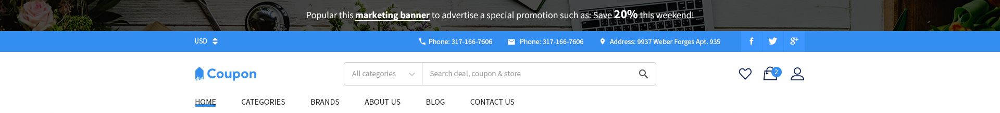

--- 

-Preset 3:


--- 

-Preset 4:


--- 

## -> Logo

-Theme supports header with 3 logo position __left__, __center__ or __right__. It is configured in **Theme Editor** > **Header** > **Logo position**.

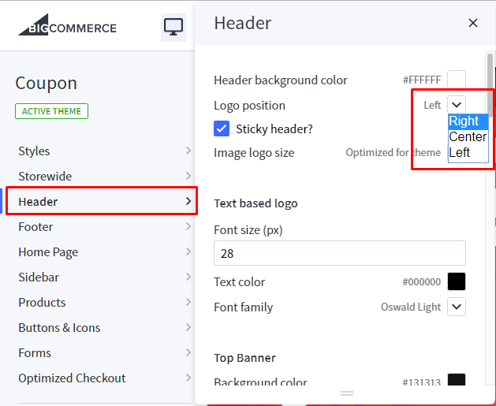

--- 

-You can configure Header style, logo size, colors, fonts in **Theme Editor** > **Header**.

## -> Mega Menu vs. Standard Menu

-Mega Menu:

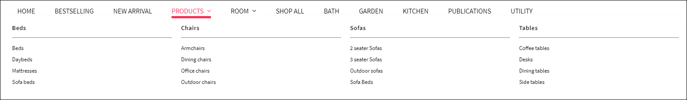

--- 

-Standard Menu (Dropdown):


--- 

-Theme supports Mega Menu or Standard Menu. You can configure in **Theme Editor** > **Header** > **Main Navigation** > **Navigation design**.


-The menu is automatically popuplated from your product categories and web pages (in **Storefront** > **Web Pages**). 

-You can hide all web pages on this menu by tick on the option **Hide web pages in main navigation** in **Theme Editor** > **Header**.

## -> Top Banner


-You can add/edit/remove the top banner content on the homepage, category pages, product pages in **Marketing** > **Banner Manager**.

-You can change background image of the top banner by edit Background Image url in **Theme Editor** > **Header** > **Top Banner**

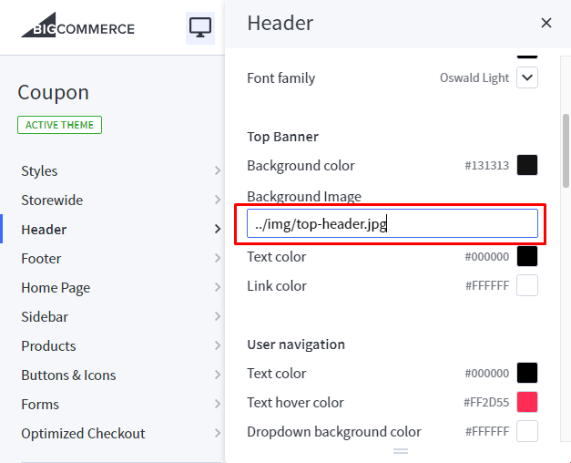

--- 

## -> Section Top Info

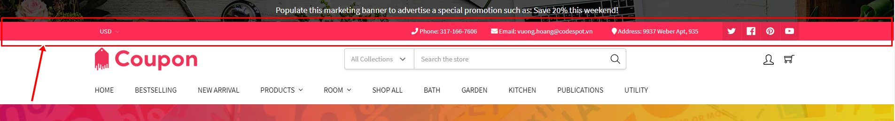

---

-You can configure layout of top information section in **Theme Editor** > **Header** > **Top header information**.

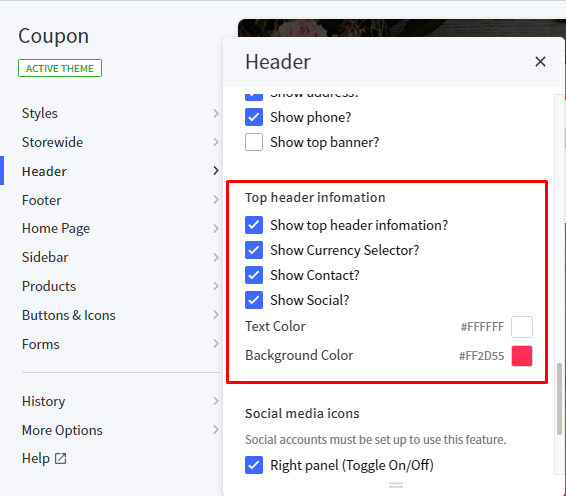

---

-For contact information, you can change it using the content below.

* **HTML Content:**

```html
{{#partial "coupon-header-top-info"}}
<div class="group-information">
    <div class="phone"><a href="tel:317-166-7606"><i class="fa fa-phone" aria-hidden="true"></i> Phone: 317-166-7606</a></div>
    <div class="email"><a href="mailto:support@designshopify.com"><i class="fa fa-envelope" aria-hidden="true"></i> Email: vuong.hoang@codespot.vn</a></div>
    <div class="address"><i class="fa fa-map-marker" aria-hidden="true"></i> Address: 9937 Weber Apt, 935</div>
</div>
{{/partial}}
```
<!-- Or use button below to generate HTML code with your custom content: -->

<!-- Button trigger modal -->
<!-- <button type="button" class="btn btn-primary btn-lg" data-toggle="modal" data-target="#lightbulbs_banner_1">
  Launch Banner Code Generator
</button> -->

---

* You can change content of this section by edit the file `templates/coupon-custom.html`.
* You need to change HTML Code content from `HTML Content` and insert it in between the 2 lines `Paste the custom section code below this line` and `Paste the custom section code above this line`.

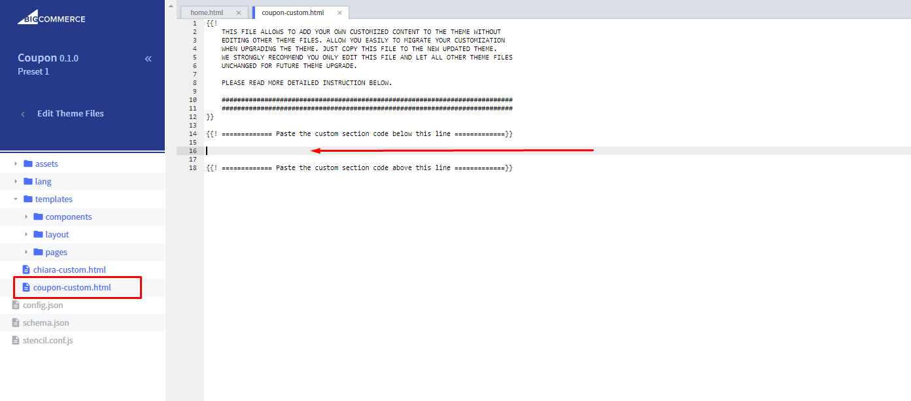

---

## -> Section 3 Icons Info
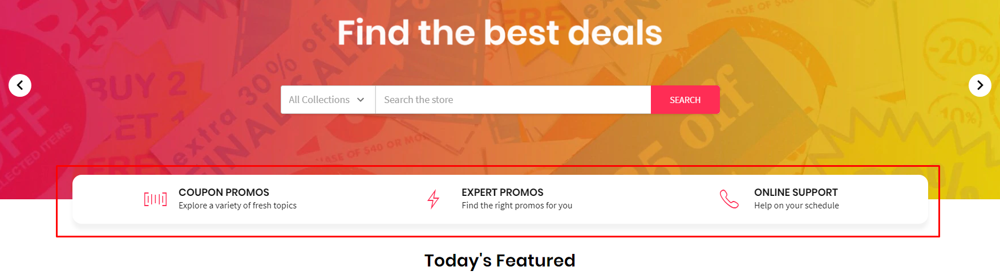

---

* **HTML Content:**

```html
{{#partial "coupon-lingerie-3infoicons"}}
<div class="chiara-section coupon-section--lingerie3infoicons">
    <div class="coupon-lingerie3infoicons">
        <div class="coupon-lingerie3infoicons-list">
            <div class="coupon-lingerie3infoicons-item">
                <div class="coupon-lingerie3infoicons-item-inner">
                    <div class="coupon-lingerie3infoicons-img-container">
                        
                    </div>
                    <div class="coupon-lingerie3infoicons-content">
                        <p class="coupon-lingerie3infoicons-title">Coupon Promos</p>
                        <p class="coupon-lingerie3infoicons-desc">Explore a variety of fresh topics</p>
                    </div>
                </div>
            </div>
            <div class="coupon-lingerie3infoicons-item">
                <div class="coupon-lingerie3infoicons-item-inner">
                    <div class="coupon-lingerie3infoicons-img-container">
                        
                    </div>
                    <div class="coupon-lingerie3infoicons-content">
                        <p class="coupon-lingerie3infoicons-title">Expert Promos</p>
                        <p class="coupon-lingerie3infoicons-desc">Find the right promos for you</p>
                    </div>
                </div>
            </div>
            <div class="coupon-lingerie3infoicons-item">
                <div class="coupon-lingerie3infoicons-item-inner">
                    <div class="coupon-lingerie3infoicons-img-container">
                        
                    </div>
                    <div class="coupon-lingerie3infoicons-content">
                        <p class="coupon-lingerie3infoicons-title">Online Support</p>
                        <p class="coupon-lingerie3infoicons-desc">Help on your schedule</p>
                    </div>
                </div>
            </div>
        </div>
    </div>
</div>
{{/partial}}
```
<!-- Or use button below to generate HTML code with your custom content: -->

<!-- Button trigger modal -->
<!-- <button type="button" class="btn btn-primary btn-lg" data-toggle="modal" data-target="#lightbulbs_banner_1">
  Launch Banner Code Generator
</button> -->

---

* You can change content of this section by edit the file `templates/coupon-custom.html`.
* You need to change HTML Code content from `HTML Content` and insert it in between the 2 lines `Paste the custom section code below this line` and `Paste the custom section code above this line`.


---

## FOOTERS

## -> Variations

-Preset 1:

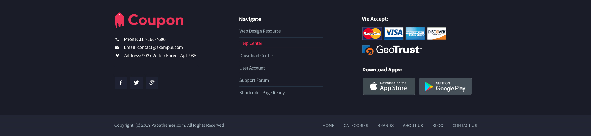

--- 

-Preset 2:

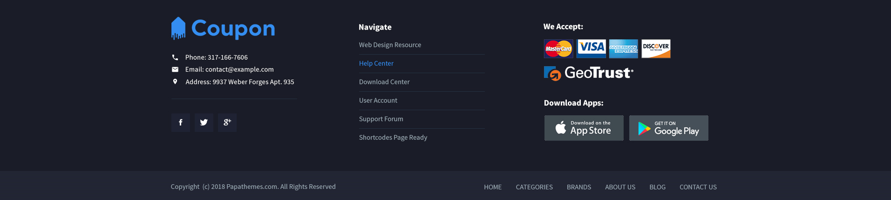

--- 

-Preset 3:

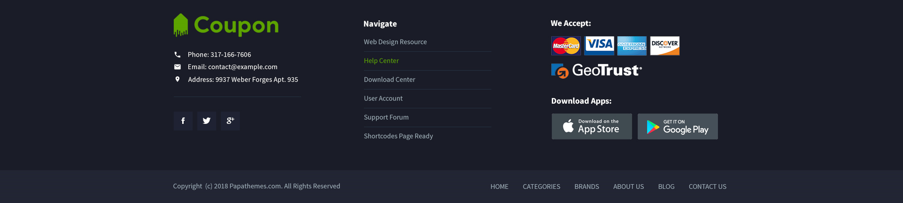

--- 

-Preset 4:

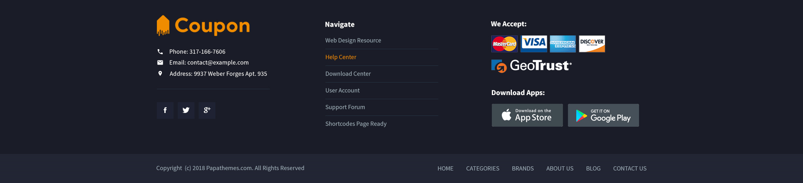

--- 

## -> Configures

Configure the footer in **Theme Editor** > **Footer** section. 

* **You can change text colors, background color of footer.**
* **Show web page links, categories or brands.**
* **Edit Download App images and links.**
* **Newsletter form support top or right position of the footer.**
* **Change text colors, background color of the copyright section.**
* **Show/hide/edit copyright links.**
* **Show/hide payment icons.**


--- 

## -> Section Contact Info

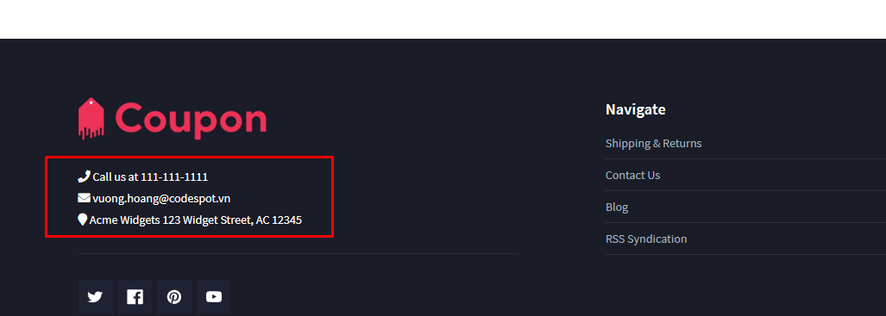

---

* **HTML Content:**

```html
{{#partial "coupon-footer-info"}}
<div class="footer-information-block">
    <div class="footer-phone"><i class="fa fa-phone" aria-hidden="true"></i></i> Call us at <a href="tel:>111-111-1111">111-111-1111</a></div>
    <div class="footer-email"><i class="fa fa-envelope" aria-hidden="true"></i> <a href="mailto:vuong.hoang@codespot.vn">vuong.hoang@codespot.vn</a></div>            
    <div class="footer-address"><i class="fa fa-map-marker" aria-hidden="true"></i> Acme Widgets 123 Widget Street, AC 12345</div>
</div>
{{/partial}}
```
<!-- Or use button below to generate HTML code with your custom content: -->

<!-- Button trigger modal -->
<!-- <button type="button" class="btn btn-primary btn-lg" data-toggle="modal" data-target="#lightbulbs_banner_1">
  Launch Banner Code Generator
</button> -->

---

* You can change content of this section by edit the file `templates/coupon-custom.html`.
* You need to change HTML Code content from `HTML Content` and insert it in between the 2 lines `Paste the custom section code below this line` and `Paste the custom section code above this line`.


---

## MAIN CAROUSEL

---

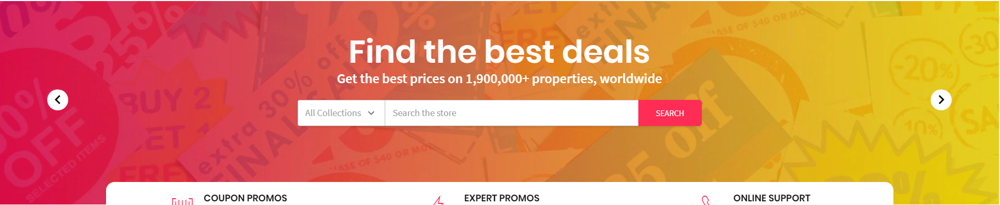

---

Main carousel displays on the home page can be input in **Storefront** > **Home Page Carousel**.

You can configure carousel settings in **Theme Editor** > **Home Page** > **Carousel** section. Here you can turn on/off this carousel, configure colors, content position and so on.

---

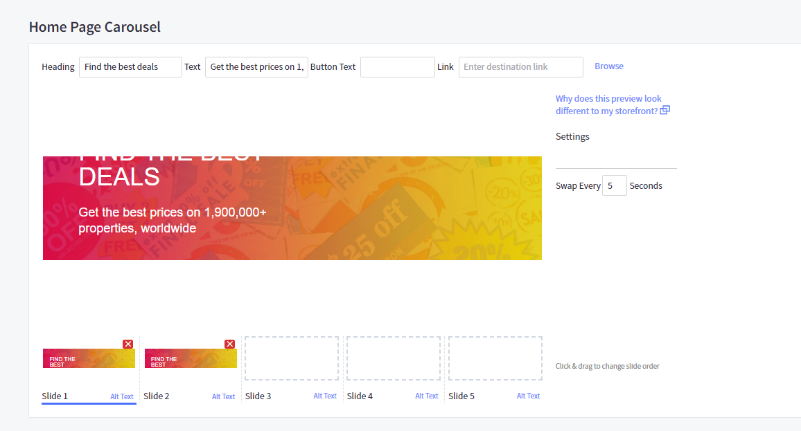

---

## HOMEPAGE SECTIONS:

## -> Sections Manager

You can select the sections displayed on the homepage (maximum 10 sections) in **Theme Editor** > **Homepage** > **Sections**.


--- 

### List of available sections name: ###

* **coupon-brands-grid**
* **coupon-featured-collections**
* **coupon-recent-blog**
* **coupon-fullwidth-banner**

* **new-products**
* **top-products**
* **featured-products**

* **Instagram**
* **store-offers**
* **lookbook-banner**
* **about-banner**
* **brands-carousel**
* **recent-blog**
* **products-by-category1**
* **products-by-category2**
* **products-by-category3**
* **products-by-category4**
* **products-by-category5**
* **products-by-category6**


###Default coupon theme sections: ###

*** All of 4 presets of the Coupon have the same section layout: ***

* **featured-products**
* **top-products**
* **new-products**
* **coupon-brands-grid**
* **coupon-featured-collections**
* **coupon-recent-blog**
* **coupon-fullwidth-banner**


## -> Products Sections (New / Featured / Bestselling)

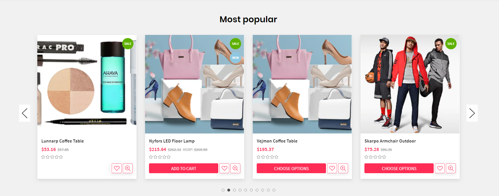

---

Configure New Products, Featured Products, Bestselling Products showing on the home page in **Theme Editor** > **Homepage**:

* **Number of products to display.**
* **Heading of the new, featured, bestselling product blocks.**
* **Sub-heading.**
* **Columns (number of products per row).**
* **Columns on tablet.**
* **Columns on mobile.**
* **Type (Grid or List).**
* **Style (default or parallax).**


---

## -> Section Brands Grid

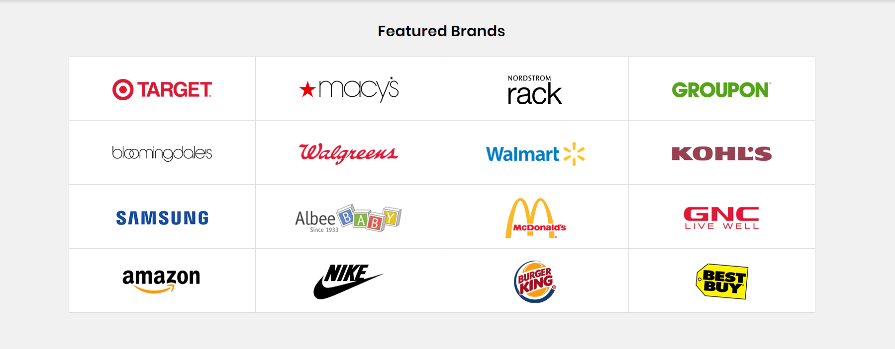

---

* **HTML Content:**

```html
{{#partial "coupon-brands-grid"}}
<div class="chiara-section coupon-section--brandsgrid coupon-section--background-fullWidth">
    <div class="coupon-brandsgrid">
        <h2 class="page-heading">Featured Brands</h2>
        <ul class="coupon-brandsgrid-list">
            <li class="coupon-brandsgrid-item">
                <a href="#">
                    
                </a>
            </li>
            <li class="coupon-brandsgrid-item">
                <a href="#">
                    
                </a>
            </li>
            <li class="coupon-brandsgrid-item">
                <a href="#">
                    
                </a>
            </li>
            <li class="coupon-brandsgrid-item">
                <a href="#">
                    
                </a>
            </li>
            <li class="coupon-brandsgrid-item">
                <a href="#">
                    
                </a>
            </li>
            <li class="coupon-brandsgrid-item">
                <a href="#">
                    
                </a>
            </li>
            <li class="coupon-brandsgrid-item">
                <a href="#">
                    
                </a>
            </li>
            <li class="coupon-brandsgrid-item">
                <a href="#">
                    
                </a>
            </li>
            <li class="coupon-brandsgrid-item">
                <a href="#">
                    
                </a>
            </li>
            <li class="coupon-brandsgrid-item">
                <a href="#">
                    
                </a>
            </li>
            <li class="coupon-brandsgrid-item">
                <a href="#">
                    
                </a>
            </li>
            <li class="coupon-brandsgrid-item">
                <a href="#">
                    
                </a>
            </li>
            <li class="coupon-brandsgrid-item">
                <a href="#">
                    
                </a>
            </li>
            <li class="coupon-brandsgrid-item">
                <a href="#">
                    
                </a>
            </li>
            <li class="coupon-brandsgrid-item">
                <a href="#">
                    
                </a>
            </li>
            <li class="coupon-brandsgrid-item">
                <a href="#">
                    
                </a>
            </li>
        </ul>
    </div>
</div>
{{/partial}}
```
<!-- Or use button below to generate HTML code with your custom content: -->

<!-- Button trigger modal -->
<!-- <button type="button" class="btn btn-primary btn-lg" data-toggle="modal" data-target="#lightbulbs_banner_1">
  Launch Banner Code Generator
</button> -->

---

* You can change content of this section by edit the file `templates/coupon-custom.html`.
* You need to change HTML Code content from `HTML Content` and insert it in between the 2 lines `Paste the custom section code below this line` and `Paste the custom section code above this line`.


---

## -> Section Featured Collections
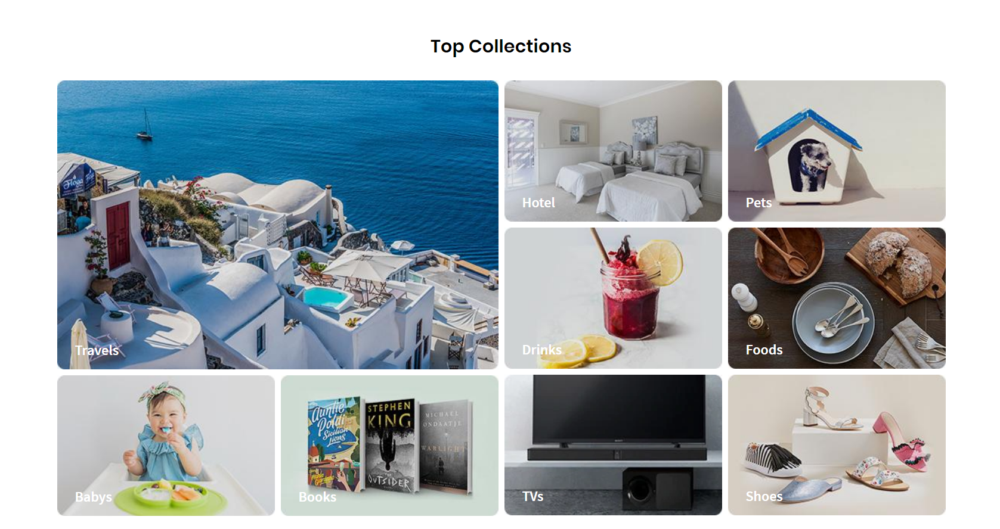

---

* **HTML Content:**

```html
{{#partial "coupon-featured-collections"}}
<div class="chiara-section coupon-section--collectionsContainer">
    <div class="coupon-collections-content">
       <h2 class="page-heading">Top Collections</h2>
        <div class="coupon-collections-banner-wrapper">
            <div class="coupon-collections-banner-left-area">
                <div class="coupon-collections-banner-area top-area">
                    <div class="coupon-collections-item">
                        <a href="#">
                            
                        </a>
                        <div class="text"><a href="#">Travels</a></div>
                    </div>
                </div>
                <div class="coupon-collections-banner-area bottom-area">
                    <div class="coupon-collections-item bottomleft-area">
                        <a href="#">
                            
                        </a>
                        <div class="text"><a href="#">Babys</a></div>
                    </div>
                    <div class="coupon-collections-item bottomright-area">
                        <a href="#">
                            
                        </a>
                        <div class="text"><a href="#">Books</a></div>
                    </div>
                </div>
            </div>
            <div class="coupon-collections-banner-right-area">
                <div class="coupon-collections-banner-area top-area">
                    <div class="coupon-collections-item rowleft-area">
                        <a href="#">
                            
                        </a>
                        <div class="text"><a href="#">Hotel</a></div>
                    </div>
                    <div class="coupon-collections-item rowright-area">
                        <a href="#">
                            
                        </a>
                        <div class="text"><a href="#">Pets</a></div>
                    </div>
                </div>
                <div class="coupon-collections-banner-area middle-area">
                    <div class="coupon-collections-item rowleft-area">
                        <a href="#">
                            
                        </a>
                        <div class="text"><a href="#">Drinks</a></div>
                    </div>
                    <div class="coupon-collections-item rowright-area">
                        <a href="#">
                            
                        </a>
                        <div class="text"><a href="#">Foods</a></div>
                    </div>
                </div>
                <div class="coupon-collections-banner-area bottom-area">
                    <div class="coupon-collections-item rowleft-area">
                        <a href="#">
                            
                        </a>
                        <div class="text"><a href="#">TVs</a></div>
                    </div>
                    <div class="coupon-collections-item rowright-area">
                        <a href="#">
                            
                        </a>
                        <div class="text"><a href="#">Shoes</a></div>
                    </div>
                </div>
            </div>
        </div>
    </div>
</div>
{{/partial}}
```
<!-- Or use button below to generate HTML code with your custom content: -->

<!-- Button trigger modal -->
<!-- <button type="button" class="btn btn-primary btn-lg" data-toggle="modal" data-target="#lightbulbs_banner_1">
  Launch Banner Code Generator
</button> -->

---

* You can change content of this section by edit the file `templates/coupon-custom.html`.
* You need to change HTML Code content from `HTML Content` and insert it in between the 2 lines `Paste the custom section code below this line` and `Paste the custom section code above this line`.


---

## -> Section Recent Blog
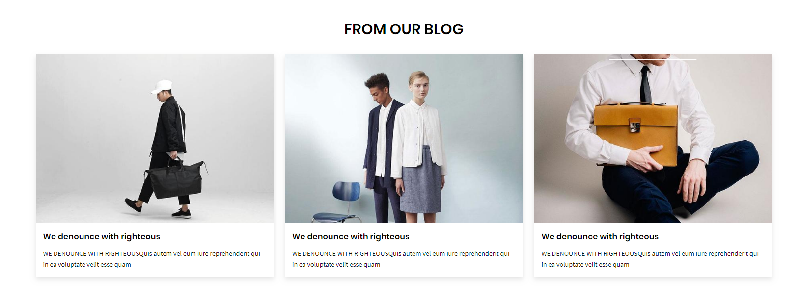

---

* **HTML Content:**

```html
{{#partial "coupon-recent-blog"}}
<div class="chiara-section chiara-section--recentBlog">
    <div class="chiara-recentBlog{{#if theme_settings.recentBlog_type}} chiara-recentBlog--{{theme_settings.recentBlog_type}}{{/if}}">
        {{#if theme_settings.recentBlog_heading}}
            <h2 class="page-heading">{{theme_settings.recentBlog_heading}}</h2>
        {{/if}}
        {{#if theme_settings.recentBlog_subheading}}
            <p class="page-subheading">{{theme_settings.recentBlog_subheading}}</p>
        {{/if}}
        <div class="chiara-recentBlog-posts">
            {{#each blog.recent_posts}}
                <article class="blog{{#if single}} blog--single{{/if}}">
                    <div class="blog-post-figure">
                        {{#if this.thumbnail}}
                            <figure class="blog-thumbnail">
                                <a href="{{this.url}}">
                                    
                                </a>
                            </figure>
                        {{/if}}
                    </div>
                
                    <div class="blog-post-body">
                        <header class="blog-header">
                            <h3 class="blog-title"><a href="{{this.url}}">{{this.title}}</a></h3>
                        </header>
                        <div class="blog-post">
                            {{{this.summary}}}
                        </div>            
                    </div>
                </article>
            {{/each}}
        </div>
    </div>
</div>
{{/partial}}
```
<!-- Or use button below to generate HTML code with your custom content: -->

<!-- Button trigger modal -->
<!-- <button type="button" class="btn btn-primary btn-lg" data-toggle="modal" data-target="#lightbulbs_banner_1">
  Launch Banner Code Generator
</button> -->

---

* You can change content of this section by edit the file `templates/coupon-custom.html`.
* You need to change HTML Code content from `HTML Content` and insert it in between the 2 lines `Paste the custom section code below this line` and `Paste the custom section code above this line`.


---


## -> Section Fullwidth Banner
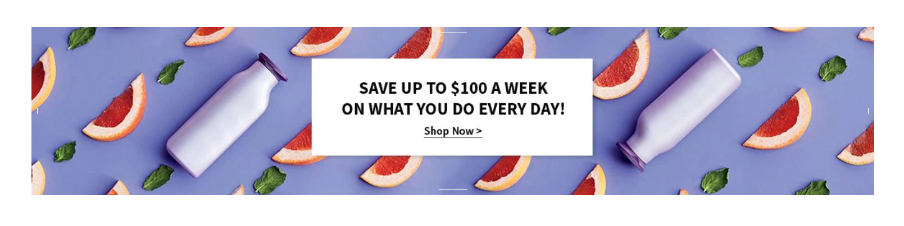

---

* **HTML Content:**

```html
{{#partial "coupon-fullwidth-banner"}}
<div class="chiara-section coupon-section--FullwidthBanner">
    <div class="coupon-FullwidthBanner wow fadeIn">
        <div class="coupon-FullwidthBanner-inner">
            <div class="coupon-FullwidthBanner-img-container">
                <a href="#"></a>
            </div>
        </div>
    </div>
</div>
{{/partial}}
```
<!-- Or use button below to generate HTML code with your custom content: -->

<!-- Button trigger modal -->
<!-- <button type="button" class="btn btn-primary btn-lg" data-toggle="modal" data-target="#lightbulbs_banner_1">
  Launch Banner Code Generator
</button> -->

---

* You can change content of this section by edit the file `templates/coupon-custom.html`.
* You need to change HTML Code content from `HTML Content` and insert it in between the 2 lines `Paste the custom section code below this line` and `Paste the custom section code above this line`.


---


## SPECIAL BANNERS:

## -> Product Category Page
---

Create a new banner in **Marketing** > **Banners**:

---

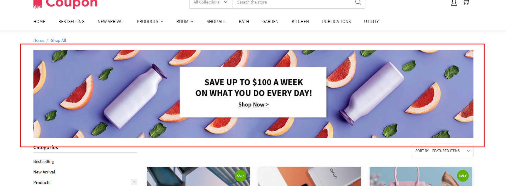

---

* **Banner Name**: `chiara-fullwidth-category-banner`
* **Banner Content**: Click on the HTML to edit HTML source.

```html
<div class="chiara-section coupon-section--FullwidthBanner" data-remote-banner-position="chiara-fullwidth-category-banner">
<div class="coupon-FullwidthBanner wow fadeIn">
<div class="coupon-FullwidthBanner-inner">
<div class="coupon-FullwidthBanner-img-container"><a href="#"></a></div>
</div>
</div>
</div>
```

* **Show on Page**: `Home Page`
* **Location**: `Top of Page`

---

## -> Product Detail Top Banner
---

Create a new banner in **Marketing** > **Banners**:

---

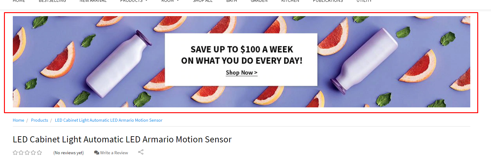

---

* **Banner Name**: `chiara-fullwidth-product-banner-top`
* **Banner Content**: Click on the HTML to edit HTML source.

```html
<div class="chiara-section coupon-section--FullwidthBanner" data-remote-banner-position="chiara-fullwidth-product-banner-top">
<div class="coupon-FullwidthBanner wow fadeIn">
<div class="coupon-FullwidthBanner-inner">
<div class="coupon-FullwidthBanner-img-container"><a href="#"></a></div>
</div>
</div>
</div>
```

* **Show on Page**: `Home Page`
* **Location**: `Top of Page`

---

## -> Product Detail Bottom Banner
---

Create a new banner in **Marketing** > **Banners**:

---

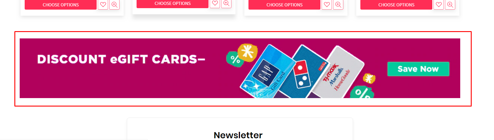

---

* **Banner Name**: `chiara-fullwidth-product-banner-bottom`
* **Banner Content**: Click on the HTML to edit HTML source.

```html
<div class="chiara-section coupon-section--FullwidthBanner" data-remote-banner-position="chiara-fullwidth-product-banner-bottom">
<div class="coupon-FullwidthBanner wow fadeIn">
<div class="coupon-FullwidthBanner-inner">
<div class="coupon-FullwidthBanner-img-container"><a href="#"></a></div>
</div>
</div>
</div>
```

* **Show on Page**: `Home Page`
* **Location**: `Top of Page`

---

## -> Cart Page
---

Create a new banner in **Marketing** > **Banners**:

---

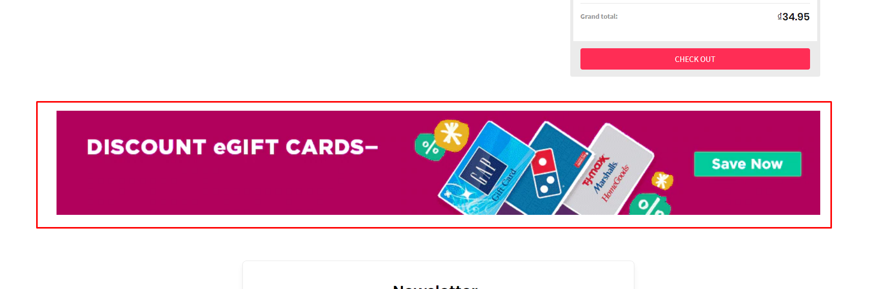

---

* **Banner Name**: `chiara-fullwidth-cart-banner-bottom`
* **Banner Content**: Click on the HTML to edit HTML source.

```html
<div class="chiara-section coupon-section--FullwidthBanner" data-remote-banner-position="chiara-fullwidth-cart-banner-bottom">
<div class="coupon-FullwidthBanner wow fadeIn">
<div class="coupon-FullwidthBanner-inner">
<div class="coupon-FullwidthBanner-img-container"><a href="#"></a></div>
</div>
</div>
</div>
```

* **Show on Page**: `Home Page`
* **Location**: `Top of Page`

---

## SIDEBAR:

## -> Banners Widget

Theme support custom banners display on the sidebar for category pages and brand pages.

---


---

To enable these banners, open **Theme Editor** > **Sidebar**, tick on these options:

* **Show banner #1 on category pages**
* **Show banner #2 on category pages**
* **Show banner #1 on brand pages**
* **Show banner #2 on brand pages**

---

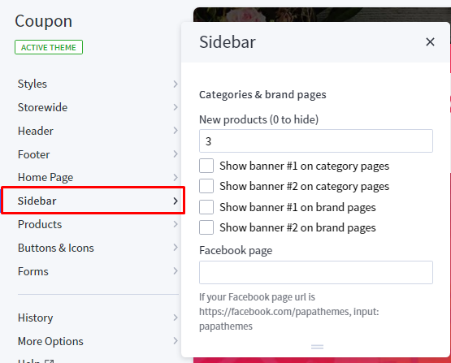

---

Create a new banner in **Marketing** > **Banners**:

---

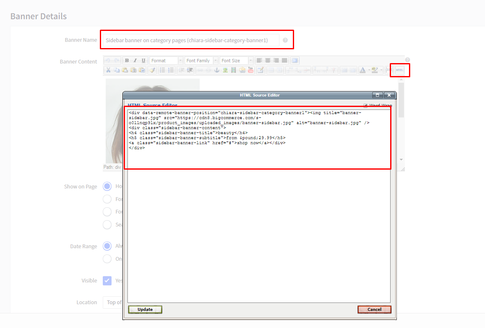

---

#### Banner 1 on category pages

* **Banner Name**: `Sidebar banner on category pages (chiara-sidebar-category-banner1)`
* **Banner Content**: Click on the HTML to edit HTML source.

```html
<div data-remote-banner-position="chiara-sidebar-category-banner1">
<div class="sidebar-banner-content">
<h4 class="sidebar-banner-title">beauty</h4>
<h5 class="sidebar-banner-subtitle">from &pound;29.99</h5>
<a class="sidebar-banner-link" href="#">shop now</a></div>
</div>
```
Or use button below to generate HTML code with your custom content:

<!-- Button trigger modal -->
<button type="button" class="btn btn-primary btn-lg" data-toggle="modal" data-target="#chiara_sidebar_category_banner1_modal">
  Launch Banner Code Generator
</button>

* **Show on Page**: `Home Page`
* **Location**: `Top of Page`

---

#### Banner 2 on category pages

* **Banner Name**: `Sidebar banner on category pages (chiara-sidebar-category-banner2)`
* **Banner Content**: Click on the HTML to edit HTML source.

```html
<div data-remote-banner-position="chiara-sidebar-category-banner2">
<div class="sidebar-banner-content">
<h4 class="sidebar-banner-title">beauty</h4>
<h5 class="sidebar-banner-subtitle">from &pound;29.99</h5>
<a class="sidebar-banner-link" href="#">shop now</a></div>
</div>
```
Or use button below to generate HTML code with your custom content:

<!-- Button trigger modal -->
<button type="button" class="btn btn-primary btn-lg" data-toggle="modal" data-target="#chiara_sidebar_category_banner2_modal">
  Launch Banner Code Generator
</button>

* **Show on Page**: `Home Page`
* **Location**: `Top of Page`

---

#### Banner 1 on brand pages

* **Banner Name**: `Sidebar banner on brand pages (chiara-sidebar-brand-banner1)`
* **Banner Content**: Click on the HTML to edit HTML source.

```html
<div data-remote-banner-position="chiara-sidebar-brand-banner1">
<div class="sidebar-banner-content">
<h4 class="sidebar-banner-title">beauty</h4>
<h5 class="sidebar-banner-subtitle">from &pound;29.99</h5>
<a class="sidebar-banner-link" href="#">shop now</a></div>
</div>
```
Or use button below to generate HTML code with your custom content:

<!-- Button trigger modal -->
<button type="button" class="btn btn-primary btn-lg" data-toggle="modal" data-target="#chiara_sidebar_brand_banner1_modal">
  Launch Banner Code Generator
</button>

* **Show on Page**: `Home Page`
* **Location**: `Top of Page`

---

#### Banner 2 on brand pages

* **Banner Name**: `Sidebar banner on brand pages (chiara-sidebar-brand-banner2)`
* **Banner Content**: Click on the HTML to edit HTML source.

```html
<div data-remote-banner-position="chiara-sidebar-brand-banner2">
<div class="sidebar-banner-content">
<h4 class="sidebar-banner-title">beauty</h4>
<h5 class="sidebar-banner-subtitle">from &pound;29.99</h5>
<a class="sidebar-banner-link" href="#">shop now</a></div>
</div>
```
Or use button below to generate HTML code with your custom content:

<!-- Button trigger modal -->
<button type="button" class="btn btn-primary btn-lg" data-toggle="modal" data-target="#chiara_sidebar_brand_banner2_modal">
  Launch Banner Code Generator
</button>

* **Show on Page**: `Home Page`
* **Location**: `Top of Page`

---


## -> Products Widget

### New Products

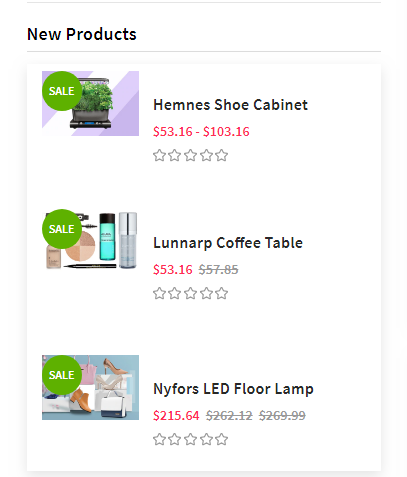

Configure in **Theme Editor** > **Sidebar**:

* **New products**: number of products to display.

## -> Social Widget

### Facebook likes & chat box


Configure in **Theme Editor** > **Sidebar**, input your facebook page name in **Facebook page** text box. If your facebook page URL is `https://facebook.com/papathemes`, input only `papathemes`. Make sure your Facebook page is public for anyone in order to display on your store.


## INSTAGRAM PHOTOS FEED

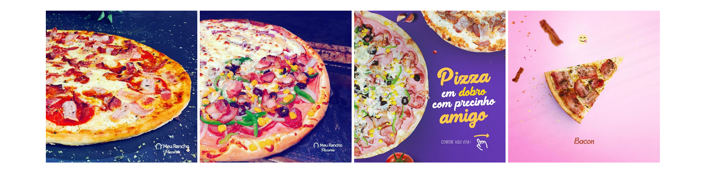

Configure Instagram section on the home page in **Theme Editor** > **Home Page** > **Instagram**:

* **Token Access**: Use this tool to generate your Instagram token access code: <https://bit.ly/2rpaWxU>.
* **Number of photos** to display.
* **Columns** (or photos per row).
* **Type**: `Boxed` - display like Furniture demo. `Fullwidth` - display like Fashion demo.
* **Heading**.
* **Subheading**.


## IMAGES OR BRANDS CAROUSEL


To display the images carousel, create a new banner in **Marketing** > **Banners**:

* **Banner Name**: `Brands carousel (brands-carousel)`
* **Banner Content**: Click on the HTML to edit HTML source.

```html
<ul class="chiara-brandsCarousel-slider" data-remote-brand-position="chiara-brand-banner-homepage">
<li class="chiara-brandsCarousel-item"><a title="Brand 1" href="#">  </a></li>
<li class="chiara-brandsCarousel-item"><a title="Brand 2" href="#">  </a></li>
<li class="chiara-brandsCarousel-item"><a title="Brand 3" href="#">  </a></li>
<li class="chiara-brandsCarousel-item"><a title="Brand 4" href="#">  </a></li>
<li class="chiara-brandsCarousel-item"><a title="Brand 5" href="#">  </a></li>
<li class="chiara-brandsCarousel-item"><a title="Brand 6" href="#">  </a></li>
<li class="chiara-brandsCarousel-item"><a title="Brand 7" href="#">  </a></li>
<li class="chiara-brandsCarousel-item"><a title="Brand 8" href="#">  </a></li>
</ul>
```

Or use button below to generate HTML code with your custom content:

<!-- Button trigger modal -->
<button type="button" class="btn btn-primary btn-lg" data-toggle="modal" data-target="#chiara_home_banner3_modal">
  Launch Banner Code Generator
</button>

* **Show on Page**: `Home Page`
* **Location**: `Top of Page`


## PRODUCT PAGE SETTINGS:

Configure settings for product pages in **Theme Editor** > **Products**.

## -> Infinite Product Loading

Theme support infinite product loading or infinite scroll on category pages, brand pages and search results pages. It is automatically enabled by default. You can configure this option in **Theme Editor** > **Products** > **Infinite Scroll**:

* **Category pages**
* **Brands pages**
* **Brand pages**
* **Search pages**


## -> Product Card & Color Swatches

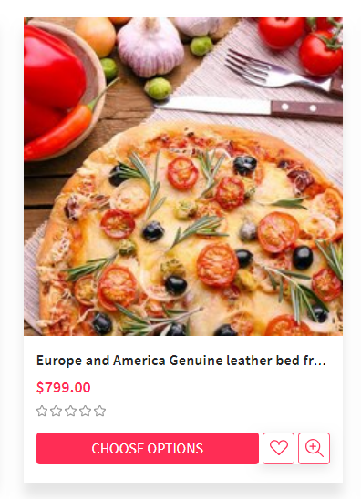

Configure how products display on listing in **Theme Editor** > **Products** > **Product cards**:

* **Product title color & hover color**.
* **Button text color & background color**.
* **Show brand**
* **Show color swatches**: To display color swatches for product options with type "Swatches".


## PRODUCT DETAIL SETTINGS:

## -> Section Top Information

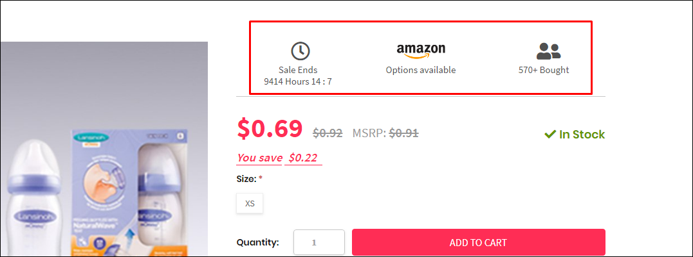

---

* **HTML Content:**

```html
{{#partial "coupon-product-view-top-detail"}}
<div class="detailinfo-top {{#each product.custom_fields}}{{#if name '==' 'Enable Top Content'}}show{{/if}}{{/each}}">
    <div class="sale-deals">
        <div class="icon"><i class="far fa-clock"></i></div>
        <div class="text">Sale Ends</div>
        <div id="timeleft" class="is-countdown" data-countdown-date="{{#each product.custom_fields}}{{#if name '==' 'Sale Countdown Time'}}{{{value}}}{{/if}}{{/each}}">
            <span class="countdown-row countdown-show3">
                <span class="countdown-section">
                    <span class="countdown-amount" id="timeleft-hours">0</span>
                    <span class="countdown-period">Hours</span>
                </span>
                <span class="countdown-section">
                    <span class="countdown-amount" id="timeleft-minutes">0</span>
                    <span class="countdown-period">:</span>
                </span>
                <span class="countdown-section">
                    <span class="countdown-amount" id="timeleft-seconds">0</span>
                    <span class="countdown-period"></span>
                </span>
            </span>
        </div>
    </div>
    
    <div class="amazon">
        <a href="#" data-link="{{#each product.custom_fields}}{{#if name '==' 'Amazon URL'}}{{{value}}}{{/if}}{{/each}}">
            
            <span>Options available</span>
        </a>
    </div>

    <div class="customerbought" data-customerbought-number="{{#each product.custom_fields}}{{#if name '==' 'Customer Bought'}}{{{value}}}{{/if}}{{/each}}">
        <div class="icon"><i class="fas fa-user-friends"></i></div>
        <div class="count"><span>0</span> Bought</div>
    </div>
</div>
{{/partial}}
```
<!-- Or use button below to generate HTML code with your custom content: -->

<!-- Button trigger modal -->
<!-- <button type="button" class="btn btn-primary btn-lg" data-toggle="modal" data-target="#lightbulbs_banner_1">
  Launch Banner Code Generator
</button> -->

---

* You can change content of this section by edit the file `templates/coupon-custom.html`.
* You need to change HTML Code content from `HTML Content` and insert it in between the 2 lines `Paste the custom section code below this line` and `Paste the custom section code above this line`.


---


### Set custom fields

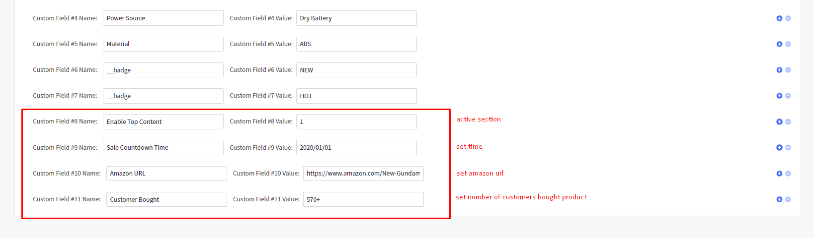

---

-You can set additional information of products by edit product > add a Custom Field:

* ** __Enable Top Content__ : ** active additional section on product
* ** __Sale Countdown Time__ : ** enter a date with format: __year/month/day__
* ** __Amazon URL__ : ** enter Amazon URL
* ** __Customer Bought__ : ** enter number of customers bought product

---

## -> Section Bottom Information

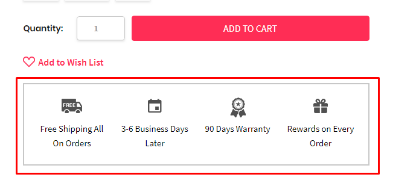

---

* **HTML Content:**

```html
{{#partial "coupon-product-view-bottom-detail"}}
<div class="detail-additional">
    <div class="add-item add-item-1">
        <div class="icon"></div>
        <div class="text"><a href="#detail-additional-add1Modal" class="detail-additional-modal">Free Shipping All On Orders</a></div>
        <div id="detail-additional-add1Modal" class="modal fade">
            <div class="modal-dialog white-modal">
                <div class="modal-content">
                    <div class="modal-header">
                        Free Shipping All On Orders
                    </div>
                    <div class="modal-body">
                        Vivamus elementum quis nunc porttitor congue. Proin dictum, mauris sed laoreet elementum, lorem
                        enim tempor turpis, id suscipit dui felis ut enim. Fusce mattis metus massa, ac congue augue
                        sodales a. Integer vel fermentum lorem. Mauris in nisi et dui faucibus suscipit in a ligula.
                        Sed ex metus, efficitur vitae lacinia ac, facilisis suscipit magna.
                    </div>
                    <button type="button" class="close" data-dismiss="modal" aria-label="Close">
                        <i class="zmdi zmdi-close"></i>
                    </button>
                </div>
            </div>
        </div>
    </div>
    <div class="add-item add-item-2">
        <div class="icon"></div>
        <div class="text"><a href="#detail-additional-add2Modal" class="detail-additional-modal">3-6 Business Days Later</a></div>
        <div id="detail-additional-add2Modal" class="modal fade">
            <div class="modal-dialog white-modal">
                <div class="modal-content">
                    <div class="modal-header">
                        3-6 Business Days Later
                    </div>
                    <div class="modal-body">
                        Pellentesque dolor augue, euismod vel orci in, congue sodales nunc. Duis sed auctor dolor, ac
                        facilisis mi. Duis malesuada, arcu ut ultricies pretium, nulla tortor egestas nisl, feugiat
                        dictum mauris elit eu nisi. Donec hendrerit magna a consectetur ullamcorper.
                    </div>
                    <button type="button" class="close" data-dismiss="modal" aria-label="Close">
                        <i class="zmdi zmdi-close"></i>
                    </button>
                </div>
            </div>
        </div>
    </div>
    <div class="add-item add-item-3">
        <div class="icon"></div>
        <div class="text"><a href="#detail-additional-add3Modal" class="detail-additional-modal">90 Days Warranty</a></div>
        <div id="detail-additional-add3Modal" class="modal fade">
            <div class="modal-dialog white-modal">
                <div class="modal-content">
                    <div class="modal-header">
                        90 Days Warranty
                    </div>
                    <div class="modal-body">
                        Donec est orci, condimentum et eleifend scelerisque, ultrices eget nunc. Quisque varius egestas
                        convallis. Quisque arcu risus, consequat sit amet vestibulum id, aliquam eu ipsum.
                    </div>
                    <button type="button" class="close" data-dismiss="modal" aria-label="Close">
                        <i class="zmdi zmdi-close"></i>
                    </button>
                </div>
            </div>
        </div>
    </div>
    <div class="add-item add-item-4">
        <div class="icon"></div>
        <div class="text"><a href="#detail-additional-add4Modal" class="detail-additional-modal">Rewards on Every Order</a></div>
        <div id="detail-additional-add4Modal" class="modal fade">
            <div class="modal-dialog white-modal">
                <div class="modal-content">
                    <div class="modal-header">
                        Rewards on Every Order
                    </div>
                    <div class="modal-body">
                        Vivamus elementum quis nunc porttitor congue. Proin dictum, mauris sed laoreet elementum, lorem
                        enim tempor turpis, id suscipit dui felis ut enim. Fusce mattis metus massa, ac congue augue
                        sodales a. Integer vel fermentum lorem. Mauris in nisi et dui faucibus suscipit in a ligula.
                        Sed ex metus, efficitur vitae lacinia ac, facilisis suscipit magna.
                    </div>
                    <button type="button" class="close" data-dismiss="modal" aria-label="Close">
                        <i class="zmdi zmdi-close"></i>
                    </button>
                </div>
            </div>
        </div>
    </div>
</div>
{{/partial}}
```
<!-- Or use button below to generate HTML code with your custom content: -->

<!-- Button trigger modal -->
<!-- <button type="button" class="btn btn-primary btn-lg" data-toggle="modal" data-target="#lightbulbs_banner_1">
  Launch Banner Code Generator
</button> -->

---

* You can change content of this section by edit the file `templates/coupon-custom.html`.
* You need to change HTML Code content from `HTML Content` and insert it in between the 2 lines `Paste the custom section code below this line` and `Paste the custom section code above this line`.


---